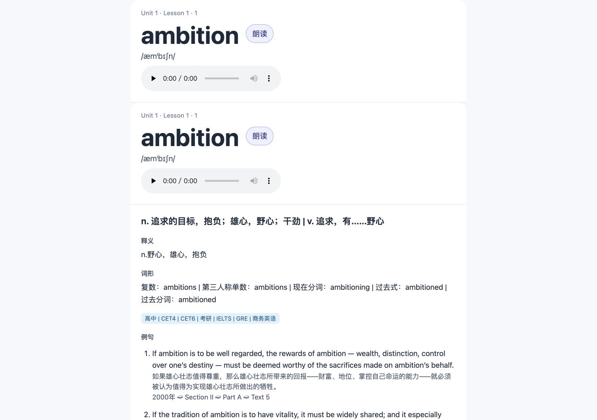

# Anki 词汇流水线 · 重建候选版

从英语词表、词典资料、真题和人工译文生成 Anki 卡包。当前源码版本为 **3.0.0-rc.1**（Python 版本写法 `3.0.0rc1`）。这是独立重建目录，旧 V2.0 原始资料保持不变。

私人仓库：[CHNragdoll/anki-pipeline](https://github.com/CHNragdoll/anki-pipeline)。发布状态以仓库 PR、tag 和 Release 为准；版本文件本身不代表已经发布。

## 先看结果

真实迁移保留 **1,960 个单词、23,508 条例句**；其中 **7,660 条未通过严格词形匹配的句子被隔离保留**，不直接进入卡片。通过匹配的句子中 **36 条译文需要补全或核验**，不伪造译文。

本地生成的卡包包含 **1,960 张卡片、1,960 个音频、41 个课程子牌组**。每张卡默认最多展示 5 条已对齐、通过校验的例句；数据库保留全部例句。没有可用例句的单词仍保留基础卡片。



截图来自浏览器预览，不是 Anki 客户端截图。手机宽度、音频播放和更多验证见 [验证记录](docs/VERIFICATION.md)。

## 如何使用

```sh
cd /Users/apple/Documents/PyCharm/Anki/anki_rebuild
uv sync --frozen --extra dev
uv run anki-pipeline doctor
uv run anki-pipeline check --report output/quality-check.json
uv run anki-pipeline build
```

已在本机完成迁移；无需重新导入旧库。其他机器请先调整 `config.toml`，然后执行 `uv run anki-pipeline migrate`。路径相对于配置文件，不依赖启动目录；可写路径限制在新版 `project.root` 内。远端仓库不含原始词库、真题、音频、数据库和生成卡包。

| 本地结果 | 路径 |
| --- | --- |
| 新数据库 | `data/anki.sqlite3` |
| 新卡包 | `output/anki-rebuilt-3.0.0rc1.apkg` |
| 可直接打开的卡片预览 | `output/preview.html` |
| 待核验译文表 | `output/pending-translations.csv` |
| 全部质量问题 | `output/quality-report.json` |
| 数据库备份 | `backups/` |

**本候选版使用新的 Anki 笔记模型和 GUID。** 导入已有 V2.0 笔记的集合时会形成独立笔记，不会自动继承旧卡片的复习进度。先在独立 Anki 配置/集合中试用；本项目没有操作你的 Anki 集合。桌面端、AnkiDroid 和 AnkiMobile 的实际导入仍待验收。

## 常用流程

```sh
# 翻译表：每句一行，乱序无妨；不要改 ID、原文、来源和校验列
uv run anki-pipeline export-translations --file output/new-pending.csv
# 只修改 translation 列后回填。过期表不会覆盖更新后的译文。
uv run anki-pipeline import-translations --file output/new-pending.csv

# 新词表、新真题（只写新版库）
uv run anki-pipeline import-wordbook --file /你的路径/词表.xlsx
uv run anki-pipeline extract --pdf /你的路径/真题.pdf

# 显式联网补空；保留已有人工修正
uv run anki-pipeline enrich --provider oxford --limit 10
uv run anki-pipeline enrich --provider youdao --limit 10

# 备份；恢复必须指向尚不存在的新文件
uv run anki-pipeline backup
uv run anki-pipeline restore --file backups/某次备份.sqlite3 --to data/restored.sqlite3
```

旧词表有 1,961 个词条，旧成品数据库有 1,960 个；本次迁移以成品库为基准，没有悄悄混入差额词条。词典在线接口可能改变或拒绝请求，命令会明确报错；已迁移数据可完全离线制卡。完整操作与恢复说明见 [操作手册](docs/OPERATIONS.md)。

## 重建修复

- 完整词形匹配，使用明确词形变化，避免 `theme → them`、`rate → rather`。
- 原文、译文和来源分列存储，用稳定句子 ID 对齐，不再把 `[n]` 中文行重新当成原文。
- 事务写入、SQLite 在线备份、恢复对账、原始资料哈希、失败时保护旧结果。
- CSV 内容哈希和译文版本校验，防止错位及旧表覆盖新译文。
- 稳定牌组/笔记 ID、课程分层、自然排序、HTML 转义、MP3 校验、原子打包。
- HTML/CSS/JS 分离，清除过期倒计时；预览内嵌音频，支持手机宽度。
- 依赖锁定、安全回归测试、独立审查、版本/标签/PR 记录。

## 维护与资料

- [本次计划与验收](PLAN.md) · [变更记录](CHANGELOG.md)
- [架构](docs/ARCHITECTURE.md) · [标准采纳](docs/PROJECT_PROFILE.md) · [适用性与状态](docs/CONFORMANCE.md)
- [独立审查](docs/REVIEW.md) · [依赖与许可证](docs/DEPENDENCIES.md)
- [素材目录](assets/README.md) · [测试与截图](docs/VERIFICATION.md)

```sh
uv run python -m unittest discover -s tests -v
uv run python scripts/verify_project.py
uv run python scripts/verify_local_trial.py  # 需要本地旧资料和生成结果
```

本项目仅在私人仓库内维护，不赋予第三方词典、真题、音频新的传播许可。PyMuPDF 的 AGPL/商业许可信息见依赖记录；对外分享或提供服务前需重新评估使用方式。没有声明生产可用或全标准通过。
