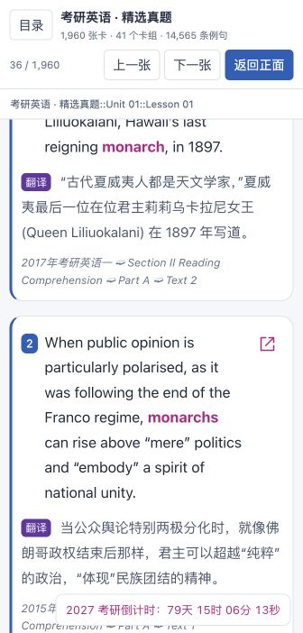
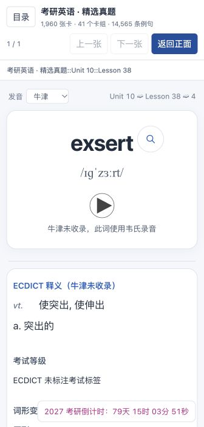

# ECDICT 补缺与考试标签接入

> 本页补充图片保留此前核验时的状态，文件名前缀 `historical-` 表示历史证据；当前 rc.3 功能和本轮实际点击截图以仓库首页为准。

任务为 `change / feature / R2 / local-trial`。用户授权本地接入缺失释义、缺失词形、考试标签，并追加授权让真题例句匹配以韦氏词形为准，韦氏词形栏为空时使用 ECDICT。R2 原因：词义来源与匹配结果会影响学习内容，需要来源对账、匹配回归及真实预览核查。

## 范围和规则

- 牛津有中文义项时保持完整原义项；整条没有中文义项时使用 ECDICT 中文字段，明示来源。
- 韦氏词形变化与派生词各自优先；只在对应整栏为空时尝试 ECDICT 的明确记录，不混入、替换已有韦氏记录。
- 当前 ECDICT 的 exchange 只有屈折变化和词元链接，没有完整明确的派生词关系。0/1 词元元数据不充当词形或派生词；未提供派生词时保留缺失状态。
- 考试标签全部取 ECDICT 的 tag；缺标签时明确未标注，不回退到原考试等级。
- 例句匹配与目标词高亮采用同一组词形：韦氏优先，整栏为空时采用经过词性核查的 ECDICT 词形。派生词不匹配，无词干推测或模糊命中。
- 韦氏行明确标注原形 `base` 时，只接受属于本卡单词或词表明确声明的美式拼写的词形；不把父词的其他变形算入本卡。例如 `means` 页里的 `meaning/meant` 标注属于 `mean`，不能纳入 `means` 的例句。原始词典展示保持来源记录。
- 完形继续先回填正确答案，再匹配完整单词；回填处下划线、逐句译文、来源位置和跳转方式保持原逻辑。

不增加星级、频率、词根或近义词功能。原词库 SQLite、原词表、真题索引、牛津/韦氏及 ECDICT 原文件只读。构建生成新网页版本、APKG 和 ZIP；不导入真实 Anki 档案、不同步、不推送或远程发布。

## 验证与恢复

保留原输出基线及历史网页版本。核对源库逻辑摘要不变、1,960 张卡片稳定身份与十字段模型，分别记录原词典覆盖与补缺数量。匹配变化以新旧例句差异报告核查，不能沿用旧例句数量作为本次验收。

2026-09-30 最终构建已完成。执行顺序为：加载牛津/韦氏 → 加载 ECDICT 并按整栏规则补缺 → 匹配真题 → 生成 APKG、完整网页与离线 ZIP。ECDICT MIT 许可随网页与卡包保留。

| 项目 | 最终实际结果 |
| --- | --- |
| 卡片 / 卡组 | 1,960 / 41，稳定身份与十字段模型保持 |
| 例句 | 14,565，覆盖库内 2000–2026 年的 44 份考研真题 |
| 新旧例句对账 | 保留 14,354，新增 211，移除 92；70 张卡例句变化 |
| 新增例句来源 | 韦氏词形 168；ECDICT 补充词形 43 |
| 牛津释义补缺 | 1 个：exsert 使用 ECDICT |
| 词形变化补缺 | 48 个单词、79 行 ECDICT 明确词形记录 |
| 派生词 | 保持韦氏 1,394 个单词的记录；ECDICT 无明确派生词关系，因此未补造 |
| 考试标签 | 1,946 个有 ECDICT 标签；14 个明确显示未标注 |
| 高亮 / 完形核对 | 14,865 处目标词高亮、1,279 条完形例句及 2,295 处答案下划线，全量核对通过 |
| 音频 | 原 6,530 个打包媒体名称及内容保持，缺失/新包闲置均为 0 |

全量 Python 测试 222 项通过；独立词形归属审查没有剩余实质发现。实际 Anki 26.9.3 临时覆盖导入通过，身份、模型、卡组归属与抽样复习进度保持。此核验使用临时 collection，未操作用户真实档案或同步。

源库逻辑摘要为 `0fd7f815e89eacfe9d6293d1070bb9d085864c0055d0d530f1c5d9a866db8ffe`，与构建前相同；四份原始词典文件的大小及修改时间保持。最终网页版本摘要为 `8209798523473bcacc87b4b7bf825b77715df8bdbaf050216476d11d5e2c013f`。

- APKG SHA256：`6d9f4a7c0a75df42e53b47d040b0b9c46640abc06639490e7df3a02b1fd3f3e8`
- 网页 ZIP SHA256：`1298ecf8fecbb8b70da723e7a9c500298207fb57c7f3d01cde9b6f50d142b0b2`
- [全量匹配审计](../output/ecdict-matching-verification.json)
- [临时 Anki 导入核验](../output/ecdict-anki-import-verification.json)
- [来源与打包核验](../output/ecdict-source-verification.json)
- [浏览器核查](../output/ecdict-ui-verification.json)

## 最终网页实测截图

已刷新 [完整网页预览](http://localhost:8771/preview-library.html) 与完形示例入口。最终版本在实际 336 像素宽的预览面板内，页面与卡片均无横向溢出。`monarchs` 通过 ECDICT 明确复数记录纳入 `monarch`；英文高亮、逐句译文和详细来源路径显示一致。

牛津缺失的 `exsert` 明确显示 ECDICT 释义及未标注考试标签；音频仍使用已打包的韦氏录音。

词典数据和两套录音均静态打包，不依赖 8770 接口。真题原句跳转仍按原配置指向 8765 的试卷阅读器，需要该阅读器可访问；本次没有将整套试卷阅读器复制进卡包。
