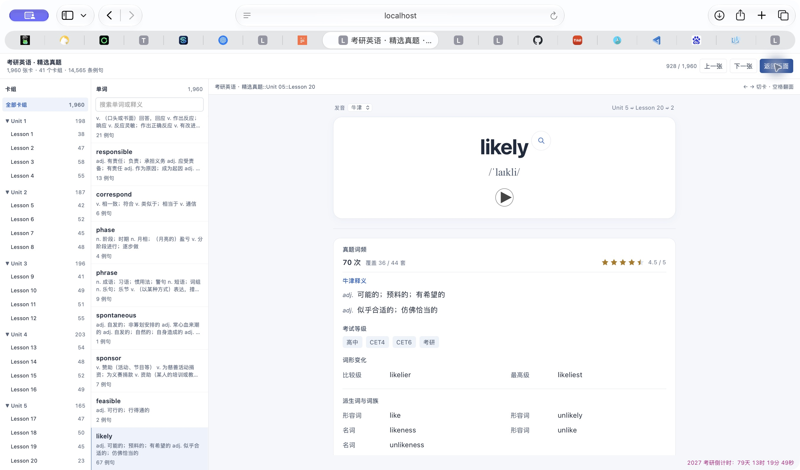
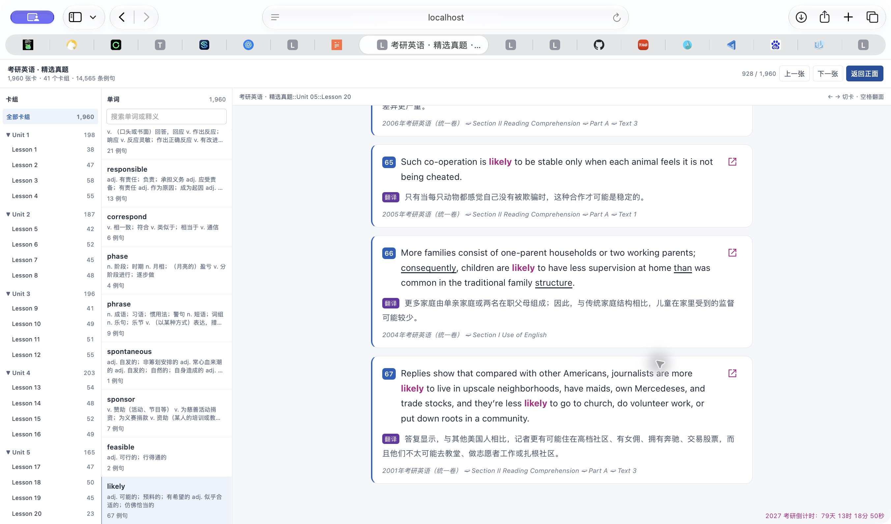
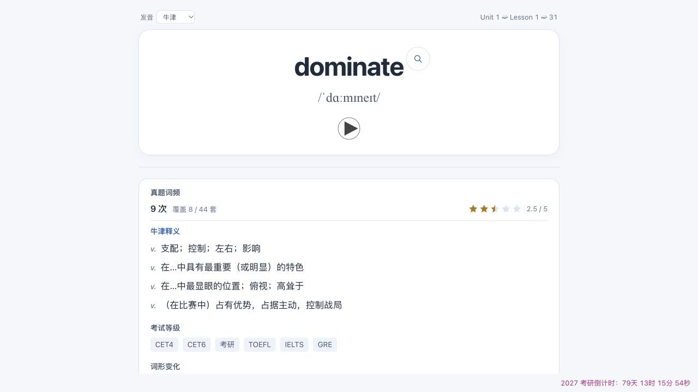

# 考研真题词频与半星评级

> 本页补充图片保留此前核验时的状态，文件名前缀 `historical-` 表示历史证据；当前 rc.3 功能和本轮实际点击截图以仓库首页为准。

本次是 `change / feature / R2 / local-trial`：新增学习参考指标，误计数会影响学习排序；原库只读，生成物可恢复。用户授权添加词频与最高 5 星、支持半星的评级，并调整间距、统计顺序与倒计时位置。沿用当前工作区，不涉及提交、发布或真实 Anki 账户导入。

## 实施与验收

1. 读取现有完整句子索引，按原词和可信词形统计实际出现次数；子代理负责累计器、源身份校验及回归测试。
2. 主代理在卡片背面、释义上方增加词频、试卷覆盖和星级，收紧词性与中文之间及区块之间的间距；网页与 APKG 共用同一渲染，保留模型和 10 字段顺序。
3. 核查所有词的实际计数、展示上限不影响统计、半星边界、输入只读和导入身份；独立评审实际变更。
4. 重建全部网页、独立样例、网页 ZIP 与 APKG，在真实预览页确认展示。该重建生成文件，不写源数据库。

## 统计口径

- 语料为当前考研句子索引：44 套试卷、1,941 段、6,199 句。包含阅读正文、填回答案的完形正文、段落型选项、写作题干和翻译正文；没有声称覆盖未进入索引的说明或短选项。
- 一处完整单词匹配算一次，同一句出现两次算两次。忽略大小写，使用已有完整单词边界规则。
- 原词及词典明确提供的复数、时态、分词等计入原词；韦氏优先，无词形时 ECDICT 补充。词形的原形须属于本词，避免父词误并入。派生词与词族不计入。
- 同一源句身份是 `(paperId, paragraph_id, sentence_index)`。不同源位置的相同句子分别计算；重复段落 ID 或重复试卷 ID 拒绝生成。
- `occurrences` 为出现次数，`matched_sentences` 为包含该词的源句数，`paper_count` 为包含该词的试卷数，`corpus_papers` 为语料总卷数。
- 完形先按已核对答案还原，再匹配和计次；原答案下划线继续保留。
- 统计扫描全部源句，独立于展示例句的数量上限。英文确实出现但中文尚未对齐的句子仍计词频，例句展示仍只使用逐句对齐译文。
- 单词之间的统计独立，不能将全部卡片次数相加当成去重后的语料词数。

## 星级规则

`occurrence-bands.v1` 是本项目按真题出现次数定义的学习参考等级，不是牛津、韦氏或 ECDICT 的官方星级。评级固定，不因词表筛选、显示例句数量或其他词的增减而变化。

| 出现次数 | 星级 |
| --- | --- |
| 0 | 0 |
| 1 | 0.5 |
| 2 | 1 |
| 3–4 | 1.5 |
| 5–7 | 2 |
| 8–12 | 2.5 |
| 13–19 | 3 |
| 20–29 | 3.5 |
| 30–49 | 4 |
| 50–79 | 4.5 |
| 80 及以上 | 5 |

每张卡显示 5 个星形，半星仅填充左半，并以数字及无障碍标签提供准确分数。零次显示零星，不冒充低频词；频率信息仅在背面出现，位于释义标题之前。统计和渲染输入校验失败时拒绝生成，不猜测或静默替换分数。

## 旧卡组导入兼容

临时 Anki 后端实测发现，legacy genanki APKG 覆盖导入更新字段时保留了原模型 CSS 和模板。频率组件因此在现有 Definition 字段中自带固定的局部布局、颜色、SVG 尺寸与半星裁切样式；该任务没有依赖模型 CSS 更新。原释义 HTML 完整保留在字段末尾，前面新增统计和对应来源的释义标题，固定局部样式隐藏模板的重复标题并收紧间距。倒计时的固定 helper 追加在 Meta 字段，原课次文本作为完整前缀保留；模型 ID、10 字段顺序和其余 8 字段保持。

## 倒计时布局

倒计时位于卡片预览区域右下角的独立底栏，透明、无边框和背景。它通过普通流占位，不使用 fixed 或 sticky 覆盖例句；内容区独立纵向滚动。Web 正反面共用一个底栏；Anki 优先在 `#qa` 内建立布局，保留宿主以外的控件、脚本和原音频节点。

固定 helper 随卡片 Meta 字段打包，能覆盖安装中的旧悬浮样式和计时脚本。它在 DOM 解析完成后建立布局，切卡可重建，重复执行只保留一个底栏与计时器，离开页面停止计时，返回缓存页恢复。切换到其他笔记类型时释放自己持有的布局和计时器，恢复宿主原来的滚动能力；旧计时脚本不能覆盖当前计时器。

## 恢复

当前任务之前的代码、APKG、网页 ZIP、入口和报告在 `output/history/before-exam-frequency/`，其 `baseline.json` 记录文件哈希与源库逻辑摘要。旧完整网页版本仍保留在输出目录中。恢复时只替换该任务涉及的生成物和代码，不覆盖其他用户改动。

## 验证

最终网页版本为 `a24b0904ba304ad6dea2013820d04f3d480f55fc864d915bfde3117b870af11f`，APKG SHA-256 为 `1af51d3ad6fe9e10a8fab1614707eb0d15943442118b8e7928b627ce7752fa64`。

- 最终冻结代码通过 239 项 Python 测试和 53 项控件测试；日志位于 `output/exam-frequency-final-python-tests.log` 与 `output/exam-frequency-final-controls-tests.log`。
- `output/exam-frequency-verification.json` 核对全部 1,960 张卡、14,565 条例句和 14,865 次词频。网页和 APKG 的统计组件一致，5 个星形及半星裁切逐卡核对通过；45 个源索引文件和源数据库没有改变。
- `output/exam-frequency-preview-verification.json` 记录实际最终浏览器几何检查：336px 窄预览和 1,280px 宽预览没有横向溢出；统计位于释义之前，词性与释义间距为 8px。底栏普通流占位、透明、无边框、无阴影，内容区底边等于底栏顶边。
- 独立评审发现并关闭了切换其他笔记类型后滚动被锁住的问题；使用旧 APKG 中的真实计时脚本验证兼容、重复执行、切卡、页面恢复和到期行为。
- `output/exam-frequency-anki-import-verification.json`：Anki 26.9.3 默认临时覆盖导入通过。全部 1,960 张卡正面没有泄露统计、背面统计正确；旧模型 CSS 保留的条件下，新字段自身样式有效。卡片身份、卡组、样本复习进度、10 字段顺序及 6,530 个媒体哈希保持，真实媒体扫描没有缺失或闲置文件。
- 使用实际导入模型渲染的 `output/imported-answer-dominate.html` 在浏览器复核：9 次、2.5 星、5 个星形，第三颗左半填充；`#qa` 内容与唯一透明底栏相邻，1,280px 窗口没有横向溢出。没有操作用户真实 Anki 账户或同步。

实际 Safari 预览（保留用户当前的 `likely` 卡片）：

