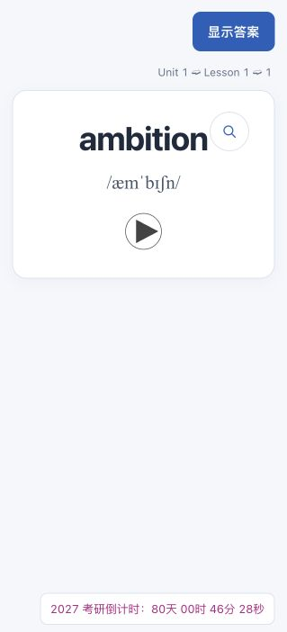
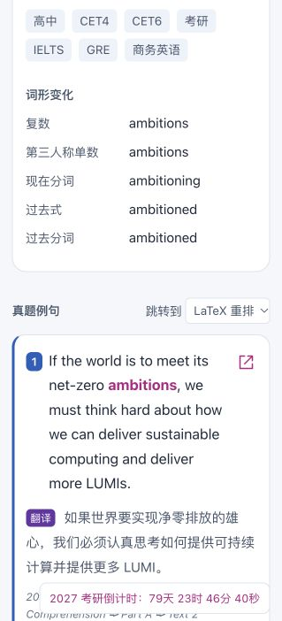
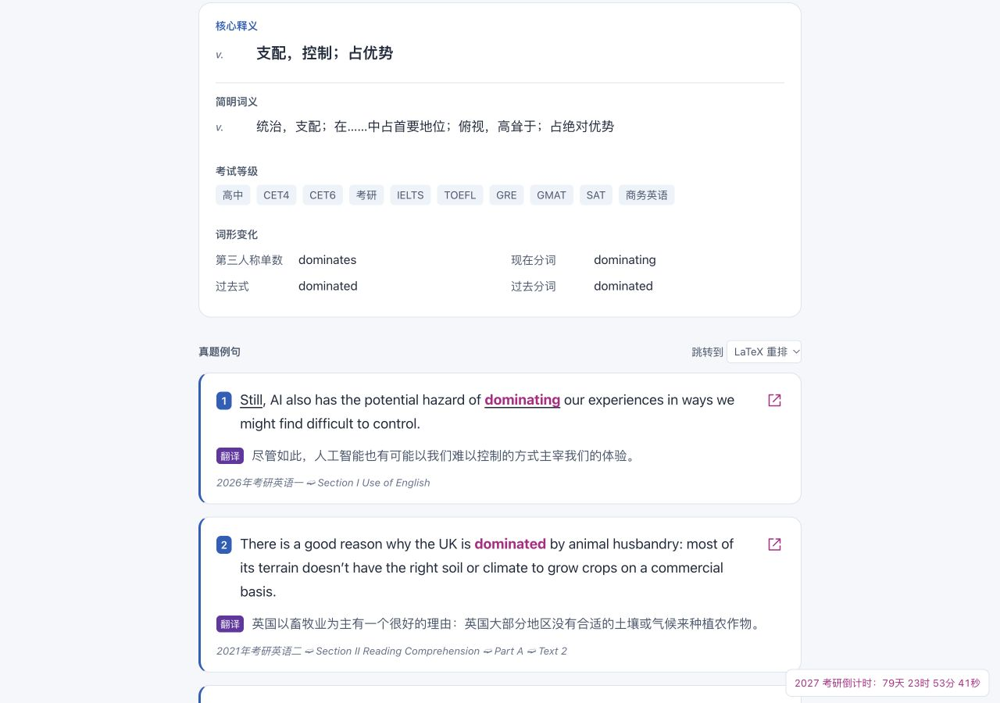
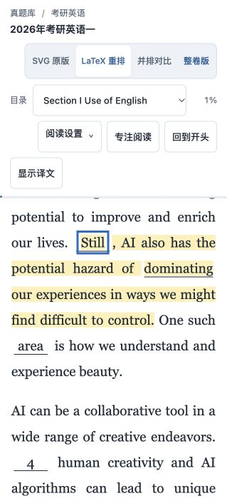
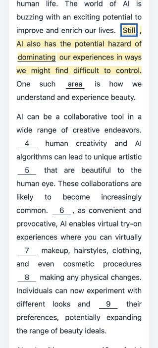

# 考研真题例句与题库定位

> 本页补充图片保留此前核验时的状态，文件名前缀 `historical-` 表示历史证据；当前 rc.3 功能和本轮实际点击截图以仓库首页为准。

本次为 feature / R2，交付目标为本地试用卡包及可运行页面。句子和中文来自相邻 exam-library 的考研卷；不纳入四六级。每个词导出所有匹配例句，按年份与原卷顺序排列，保留不同年份的相同原句和出处；题库模式的 `max_examples=0` 表示不设数量上限。匹配仅使用词条本身和明确列出的词形，避免把比较级短语中的 more / most 错当作词形。完形仅使用明确答案完成回填后再匹配词形，回填答案按其原空格位置加下划线。

保留 Anki 模型、字段顺序、词条 ID、GUID、牌组及单词音频。原有 SQLite 和例句不改写，构建时采用题库例句快照；没有匹配的词条仍保留卡片。原卡包保留，输出使用新文件名。可删除新卡包或去掉配置的 exam_library 段恢复旧构建方式。

中文仅显示对应英文句子的译文，采用题库既有中文中的逐句片段。可确定的句序自动对齐；中英拆句不一致的段落通过语义核对建立可复用的映射，保存来源和译文哈希。完整短句也收录，署名、分值、占位和误拆片段按源文结构排除或合并。核查发现的原译错误，按用户“哪里错误就改哪里”的要求，用指定的 Google 翻译网页结合上下文核校，必要时进行语境复核；登记区分 Google 原输出和 Codex 复核后的校正，不声称二者都是逐字 Google 译文。修复同时投影到库内对应段落译文，保留修复前快照、原错误、英文与原译哈希、来源链接和日期。库中缺译或无法确认对应关系的句子不进入卡片，绝不回退到整段中文。

例句为英文完整句；出处按原有箭头分隔显示试卷、Section、Part、Text 等实际目录层级。出处按钮支持 LaTeX / 整卷切换，跳转定位并高亮相应句子。回填只发生在带 Anki 定位参数的页面，普通练习保留空格。预览页的单词发音采用与 Anki 相同的圆圈和实心三角样式；卡包中的原生单词音频字段继续保留。

验收包括：来源/哈希核对、完形回填、词形边界、可重复构建、两种页面定位、模板正反面/欧路查词保留、临时 Anki collection 重导入身份与学习计划检查。页面截图另存；用户真实 Anki 资料库不直接写入。

## 2026-09-30 本地试用验收

| 项目 | 最终结果 |
| --- | --- |
| 考研正文索引 | 2000–2026 年，44 卷、1,941 段、6,199 组逐句中英对照 |
| 词卡 | 1,960 张，全部保留 |
| 导出例句 | 14,446 条；696 张卡超过五条，单词例句不再截断 |
| 示例 | ambition 14 条；dominate 9 条；even 212 条 |
| 无匹配词卡 | 298 张保留卡片，没有填入无关例句或整段中文 |
| 完形答案 | 790 个原空格的回填范围；句内仅这些答案加下划线 |
| 来源误译修复 | 9 处、8 段、7 份公开译文文件；仅 `translationZh` 改变 |

“全部”指已核实正文中所有匹配位置，不是造出题库没有的例句。6 卷中有 23 段完形因尚无可靠答案而排除，原资料保留。短句审查纳入 63 个完整短句、合并 6 处误切、登记排除 39 个标题、称呼或片段。标题明确写出的英美拼写一并匹配，例如 `humour\n(美humor)`；仅采用明示拼写及词形，不凭空推导 `humors` 等变体。

最终输出为 `output/Anki-题库例句跳转版.apkg`，旧卡包继续保留。构建报告的 `quality` 是原 SQLite 资料校验；本次题库例句数量以 `exam_library` 段为准。`output/library-examples-final.json` 保存最终导出快照，`output/exam-library-anki-import-verification.json` 保存临时 collection 导入结果。

已完成的验证：

- Python 101 项测试通过；Node 模板交互与倒计时 10 项测试通过。
- 44 卷共 6,199 英句均在对应正文中唯一命中；LaTeX 和整卷各 1,941 段运行定位通过，包含跨页段落及五种正文来源。
- 全部导出句的英文、中文、详细目录路径和真实完形范围与索引一致；标题美式别名另补 53 条。
- Anki 26.9.3 原生后端在临时 collection 中先导入旧包再更新新包：1,960 notes/cards、GUID 和 ID 保持一致，1,960 个 MP3 保留，样本复习间隔、次数和到期日保持一致。没有写入真实 Anki profile，没有执行同步。
- 原 SQLite 内容摘要与构建前一致：`0fd7f815e89eacfe9d6293d1070bb9d085864c0055d0d530f1c5d9a866db8ffe`。
- 译文修复经过现有 publisher 的 206 文件预检与发布后核对，保留两代完整私有快照和 206 份恢复备份。并发改写拒绝覆盖，逐文件回滚失败仍汇总余下结果；Google 输出与语境复核分别登记。
- 真浏览器已查看逐句译文、详细路径和完形下划线，并验证两种目标页面仅高亮对应句。普通练习的回填数仍为零。

卡包的 localhost 跳转需要本机题库服务保持运行。当前预览：<http://localhost:8771/preview-library.html>；完形示例：<http://localhost:8771/preview-library-cloze.html>。选择“跳转到”版本后，原句图标使用对应页面。浏览器预览已运行验证；真实 Anki GUI 中的人工复习尚未执行。

## 实际页面截图

下图为本机页面实际截图，未用示意图替代。

单词发音保留圆圈和实心三角，没有外层方框或按钮背景：

详细出处与两种跳转版本：

完形正确答案回填、原空格答案下划线和对应一句的译文：

LaTeX 与整卷页面的原句定位：

