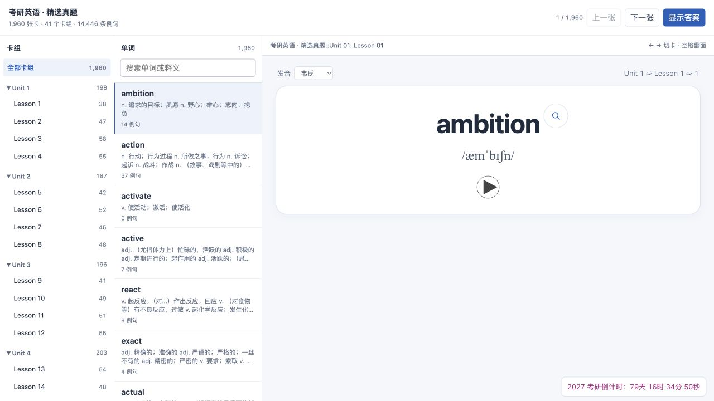
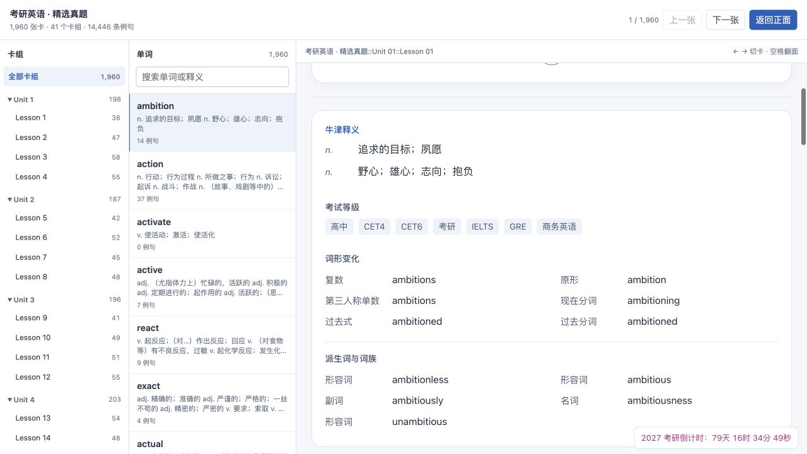
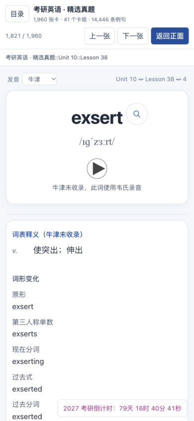
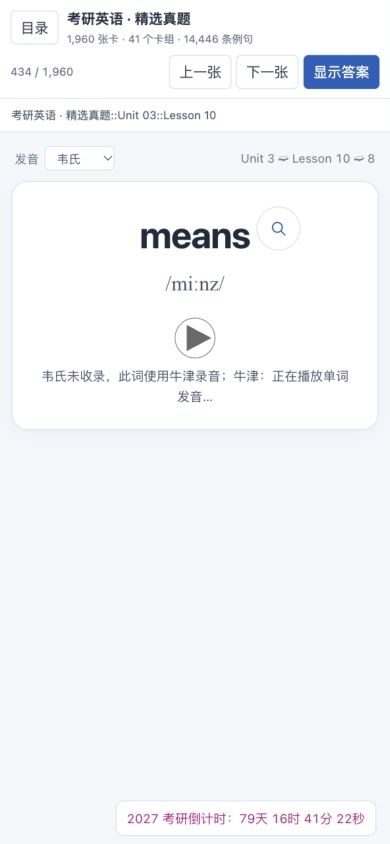

# 本地双词典 Anki 与完整网页包

> 本页补充图片保留此前核验时的状态，文件名前缀 `historical-` 表示历史证据；当前 rc.3 功能和本轮实际点击截图以仓库首页为准。

本次把用户已解包的牛津和韦氏资源接入现有考研真题词卡，同时输出完整网页预览 ZIP 与 Anki APKG。释义、词形和单词录音在构建时读取本地文件，查看卡片时不调用 `localhost:8770/api/combined`，也不重新解析 MDX/MDD。

任务口径为 `change / feature / R2 / local-trial`：新增本地资源打包与全局发音来源选择，影响可以通过保留的旧包和历史网页资源恢复。本记录不是正式发布记录；不涉及真实 Anki 用户档案导入、同步、数据库迁移、推送、PR 合并、打标签或远程发布。

## 使用和构建

在已配置依赖的项目环境运行：

```sh
python -m anki_pipeline offline-bundle
```

本项目现有虚拟环境对应命令：

```sh
.venv/bin/python -m anki_pipeline offline-bundle
```

`config.toml` 中 `[local_dictionary].root` 指向 `../dictionary-unpacked`，相对路径以配置文件所在目录为基准。`[exam_library].max_examples=0` 继续表示导出全部匹配例句。上述命令读取现有词库、题库句子索引和词典资源，生成以下文件：

| 文件 | 用途 |
| --- | --- |
| `output/Anki-本地双词典版.apkg` | Anki 卡包，包含两套实际词典录音 |
| `output/Anki-完整网页预览.zip` | 全部卡组、正反面和共享媒体的独立网页包 |
| `output/preview-library.html` | 项目内完整网页预览入口 |
| `output/preview-library-cloze.html` | 同一批数据的 `dominate` 完形例句检查页 |
| `output/dictionary-delivery-report.json` | APKG、网页、ZIP、原库摘要和资源覆盖报告 |
| `output/web-preview-report.json` | 完整网页版本、卡组数量、媒体与词典来源报告 |
| `output/dictionary-media/` | 实际使用的、带来源前缀的扁平 MP3 文件 |

### 独立网页包

解压整个 `Anki-完整网页预览.zip`。macOS 可双击包内的 `启动网页预览.command`；也可在解压目录运行：

```sh
python3 serve_preview.py
```

运行端只需要 Python 3 的标准库和浏览器。脚本在 `127.0.0.1` 的随机空闲端口启动包内静态文件服务并打开入口；不需要项目虚拟环境、原词典 SQLite、MDX/MDD、Anki、牛津/韦氏查询服务或联网。终端关闭或按 `Ctrl+C` 后该静态服务停止。不要只复制入口 HTML，卡片、目录和音频资产必须一起保留。

卡片支持所有现有卡组、搜索、切卡、翻面和单词录音。发音来源选择位于卡片左上角，可选牛津或韦氏，并跨卡片、翻面与刷新保存。音标下方继续使用居中的圆形播放按钮。选择来源后只播放所选来源的录音，不同时排队播放两套音频。

例句右侧的跳转保留现有真题库地址及 LaTeX / 整卷选择。查看原卷仍需另外启动原真题库服务；这个跳转地址不是词典资源的运行依赖。欧路查词继续沿用原 `eudic://` 链接。

### Anki 卡包

网页 ZIP 和 APKG 是两个独立交付物。APKG 内含实际使用的牛津与韦氏录音，不要求 `8770` 词典服务运行。音频以真实的本地 `<audio src="…">` 引用保存，供 Anki 的媒体扫描识别；来源切换由卡片脚本控制，打开卡片不会自动连续播放两套录音。

生成卡包本身不会导入或修改用户正在使用的 Anki 档案。导入兼容性在一次性临时集合内验证，最终结果填写在本文的验收记录中。

## 来源、取数边界与真实覆盖

原资源目录为 `/Users/apple/Documents/PyCharm/Anki/dictionary-unpacked`：

| 来源 | 本地文件 | 卡片采用的内容 |
| --- | --- | --- |
| 牛津高阶英汉双解第 10 版 | `oald10/dictionary.sqlite3`、`oald10/resources/` | 对应主词条的词性、中文义项、音标和词头英/美录音 |
| Merriam-Webster | `mw-now/dictionary.sqlite3`、`mw-now/resources/`、现有 `mw_parser.py` / `html_tree.py` | 原包支持的词形、派生词及词头录音 |

两个 SQLite 以 `mode=ro` 和 `PRAGMA query_only=ON` 打开。原 MDX/MDD、词典数据库及其 `resources/` 均不写入。韦氏现有解析模块在隔离的模块名下加载，避免两套同名 `lookup.py` 相互覆盖。

牛津中文只取义项中的原 `defT/chn`，不把例句译文、词源、派生词释义混入主释义。主词条确实只列短语链接、没有独立中文义项时，读取它明确链接的本地短语条目，并保留具体短语标签，例如 `consist of somebody/something：由…组成（或构成）`。`outset`、`rid` 的短语/习语释义也保留原短语名称；不把它们伪装成不限搭配的词义。

旧词表标题中的 `catalogue\n(美catalog)` 等显示说明使用第一行查词，显示标题和卡片 ID 保持原样。`inquire` 使用牛津原条目明确声明的 `enquire` 拼写变体录音。`advent` 的韦氏录音来自原包中同拼写大小写词条，保留该记录的来源。

韦氏的 `humour`、`emphasise`、`analyse`、`recognise`、`artefact`、`utilise`、`paralyse`、`endeavour`、`honour` 的录音核查仅接受原 HTML 明确声明的英美拼写关系。链接文本、目标词头和对应位置都必须一致，记录原关系词条及实际音频词条的 ID / SHA。`honour` 的多词链接只匹配 `honor`，不取 `honorable` 或 `honorary`。

只复制词头录音，不混入句子、派生词或词形变化的录音。每个 MP3 校验路径仍在原 `resources/` 目录内、类型为 MP3、字节数及 SHA-256 与 SQL 记录一致；不安全路径或损坏媒体终止构建。输出文件名带词典来源前缀和内容摘要，不改写或重命名原录音。

原包缺口和使用回退后的可用性分别计数，不能把回退算成原词典收录：

| 项目 | 原来源覆盖 | 原来源缺失 |
| --- | --- | --- |
| 牛津中文释义 | 1,959 / 1,960 | `exsert` |
| 牛津词头录音 | 1,959 / 1,960 | `exsert` |
| 韦氏词头录音 | 1,958 / 1,960 | `customs`、`means` |
| 韦氏匹配词条 | 1,960 / 1,960 | 无 |

上表已经由最终 `dictionary-delivery-report.json` 复核。韦氏词形覆盖 1,690 张词卡，派生词覆盖 1,394 张；原词典没有列出的内容不由程序补造。

韦氏 `ambition` 原条目确实有动词义，注明始见于 1601 年，并列有 `ambitioned`、`ambitioning` 等变化。因此这些变化保留为韦氏原条目支持的内容，不因牛津卡片释义以名词为主而删除，也不从拼写规则自行生成。

### 三处经过明确授权的回退

| 词卡 | 请求来源缺口 | 实际采用 | 记录方式 |
| --- | --- | --- | --- |
| `exsert` | 牛津中文释义缺失 | 原词表已有 `definition` | `definition_source=wordbook`，保留原中文文本 |
| `exsert` | 牛津录音缺失 | 原韦氏 `exsert` 录音 | `fallback_audio.oxford=webster` |
| `customs` | 韦氏没有对应词头录音 | 原牛津 `customs` 录音 | `fallback_audio.webster=oxford` |
| `means` | 韦氏没有对应词头录音 | 原牛津 `means` 录音 | `fallback_audio.webster=oxford` |

这是三张词卡上的四项回退：三项录音回退、一项原词表释义回退。界面须明确显示实际来源。韦氏页面上的 `custom` / `mean` 录音没有冒充 `customs` / `means`；两套原 `audio` 列表和原 `missing` 列表保持真实缺失状态。报告用 `fallbacks.audio`、`fallbacks.definitions` 以及 `fallback_counts` 单独记录回退。

如果将来有词既无牛津中文、原词表也无中文，则继续显示缺失提示；不自动生成或翻译释义。如果两套原包均无对应录音，则保持无录音状态，不用其他单词替代。

## 身份、例句与恢复

卡片继续使用现有模型 `考研英语词汇 v1`（模型 ID `1552983369`）及十个原字段的顺序：

```text
Word, Phonetic, Definition, SimpleDefinition, Level,
WordForms, Audio, Examples, Meta, Note
```

没有新增 Anki 模型字段。新版牛津释义、韦氏词形及两套音频在原有字段中呈现，保留 GUID 生成规则、词卡 ID、牌组命名及分组。覆盖导入时是否保持实际 note/card ID 和复习进度，以临时集合导入验收结果为准。

题库例句继续包括所有年份的匹配结果、对应句子的已有译文、详细出处与原句定位。完形先用题库正确答案回填后匹配，并只为回填答案加下划线。词典接入不重新翻译例句、不改答案、不写入源词库或题库数据库。

交付基线是 1,960 张词卡、41 个课卡组和 14,446 条例句。无例句词卡以及原库的 Unit 999 / Lesson 999 保留。

旧 `output/Anki-题库例句跳转版.apkg` 保留作历史基线，记录的 SHA-256 为：

```text
e6b31d39e1fc46f68fc0661d7b71a75fed6b3df9680fdfe879e4da9ce2fda2e4
```

此前只读源词库内容摘要为：

```text
0fd7f815e89eacfe9d6293d1070bb9d085864c0055d0d530f1c5d9a866db8ffe
```

最终报告再次核对了这两项摘要，当前值与历史基线一致。网页完整资产按 `output/web-preview/<input_digest>/` 保存，旧版本目录保留。单个 APKG、网页版本或 ZIP 均先验证再发布对应输出；最终交付报告用于确认本次整套产物一致，不能把中途已生成的单个文件当成整套验收完成。

恢复可使用保留的旧卡包或历史网页版本及其构建报告。不要通过覆盖源数据库、删除原词典或直接操作真实 Anki 档案来回滚本地预览；真实档案回退属于另行授权的操作。

## 最终构建与验收记录

2026-09-30 最终构建、浏览器验收和临时 Anki 集合覆盖导入完成。证据各自限定到观察范围。

| 证据 | 最终值 |
| --- | --- |
| 构建完成时间、Python / Anki 验证环境 | 2026-09-30 15:43:44（本机时间）；Python 3.13.14；Anki backend 26.9.3 |
| 网页卡数、卡组数、例句数 | 1,960 张卡；41 个课卡组；14,446 条全部匹配例句 |
| 词典原来源覆盖、词形与派生词覆盖 | 牛津中文 1,959；牛津音频 1,959；韦氏音频 1,958；韦氏词形 1,690；韦氏派生词 1,394 |
| 三项音频 / 一项释义回退及真实缺口 | 仅 exsert 牛津音频 → 韦氏，customs / means 韦氏音频 → 牛津；exsert 释义保留原词表并明示来源 |
| 实际 MP3 文件数、总字节数 | 6,530 个 MP3；35,490,427 字节；4,240 牛津 + 2,290 韦氏；无无音频词卡 |
| 源 SQLite 当前内容摘要与前后对比 | 0fd7f815e89eacfe9d6293d1070bb9d085864c0055d0d530f1c5d9a866db8ffe；构建前后源库逻辑摘要一致 |
| 新网页 `input_digest` 与 ZIP 对应摘要 | 1655ce4255a913a6ac8c70623915b15a40ab3c9beba8daa7a54e69c44e6d1e74 |
| 新 APKG 路径、SHA-256、ZIP 路径与 SHA-256 | APKG 66,130,083 字节 / 2002a03059690cc9da64ba28f741429f895c1ea5ca4cb9af2abd836d4e53ddd9；ZIP 53,530,995 字节 / 9db3e85e3a8b9ae67d5f908f5237758a0ec506fafb9ac73e3a25487a3cf097d0 |
| 保留旧 APKG 的当前 SHA-256 | e6b31d39e1fc46f68fc0661d7b71a75fed6b3df9680fdfe879e4da9ce2fda2e4（未改写） |
| Python / Node 回归测试 | Python 整合回归 71 项通过；最后拼写变体修改后资源及打包专项 31 项通过（其中资源 23）；Node 交互 42 项通过。日志分别为 output/dictionary-tests.log、dictionary-variant-tests.log、dictionary-ui-tests.log |
| 临时 Anki 集合：模型、十字段、GUID、note/card ID、复习进度 | output/dictionary-anki-import-verification.json：1,960 notes/cards；模型 ID、名称、十字段、GUID、note/card ID、卡组归属与复习排程样本保留；仅一次性临时集合 |
| Anki 媒体扫描：两套音频可识别，无缺失 | 6,530 个新媒体全部被 Anki 原生扫描识别且 SHA 与导入一致；missing=[]，new unused=[]。旧包 1,960 录音仍保留为旧未使用媒体，临时集合总媒体 8,490 |
| 真实网页：来源切换、音频、跨卡/翻面/刷新保存、窄窗口 | output/dictionary-browser-verification.json：Oxford / Webster 实际播放位置与时长均有效；means / exsert / customs 实际回退录音及来源可见；左上选择器跨翻面、切卡及刷新保留；390px 外层和 iframe 均 scrollWidth=clientWidth=390；单词中心偏差 0px |
| 独立 ZIP 解压运行，无 `8770` API 请求 | 最终 ZIP 解压至全新临时目录，仅使用包内 serve_preview.py --no-open，在随机端口 58324 启动。1,960 / 41 / 14,446 目录正确；humour 的韦氏录音从该端口包内相对文件实际播放，时长 0.493424s、位置 0.331362s、无错误；刷新后仍选择韦氏。运行时无 8770 字段/API 引用，无词典数据库或原 resources 目录依赖 |
| 独立审查结果及适用限制 | 独立审查无剩余实质问题；最终 APKG/ZIP 哈希、6,530 个音频、8,493 个网页清单资产、ZIP CRC 与 0755 启动脚本均核查。Anki GUI、用户真实档案和同步未运行。原句跳转字段未改；本轮浏览器原卷错误页刷新受 URL 策略阻止，未把原卷 UI 算为新增验收 |

### 实际截图

最终 ZIP 与项目预览使用同一内容摘要。桌面截图来自解压后的独立网页包，窄窗口及回退截图来自项目预览；均是实际浏览器截图。











实际浏览器证据只证明其观察到的操作；Anki 临时集合验证只证明导入身份、排程及媒体引用等结果。两类证据分别记录，不把网页播放替代真实 Anki 导入检查，也不宣称已经导入或同步用户真实档案。
