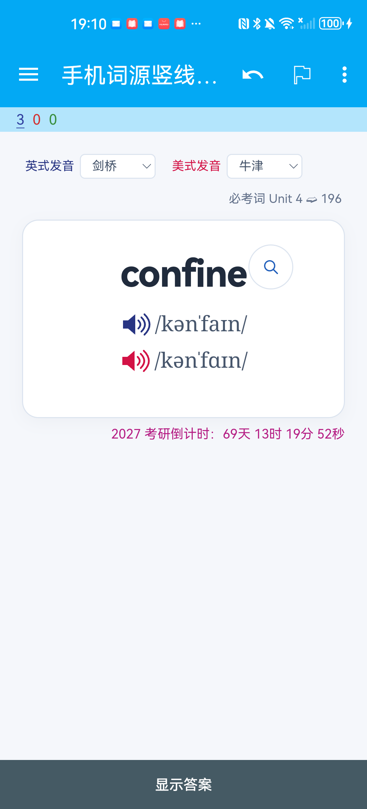
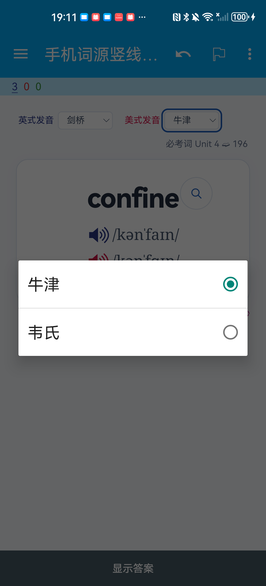
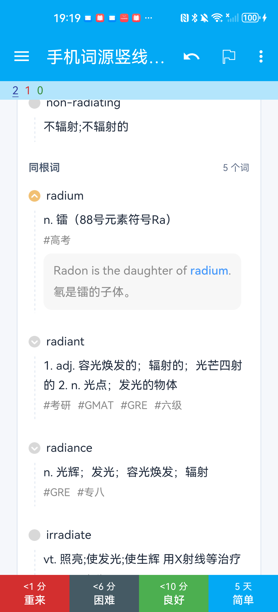

# 2026-10-10 红宝书手机词根与跳转交互核验

本次更新 2026 / 2027 **完整版**。使用维护者已确认可用的三卡测试包，在华为 OCE-AN10、Android 12 / API 31、AnkiDroid 2.20.1 上操作 `confine`、`radiate`、`apple`。真机样本用于验证共同模板，不能代替两份完整版的全部手机验收；精简版未更新。

## 修改与实际操作

- 保持原来浅色 1px 虚线外观，将竖线绘制到随内容增长的元素上；实际手机竖线可见。
- 有例句项保留居中折叠箭头，包括 apple 的首条无词头项；无可折叠例句的词或短语只显示普通圆点。
- 逐项及整体展开、收起例句均已操作，没有因此翻面或评分。
- 英美音源独立选择：美式切为韦氏后，再切英式牛津，美式仍为韦氏；点击蓝、红扬声器保持在正面。
- 手机原生“跳转到”菜单可选择 LaTeX 重排或整卷版；选择后保持当前卡面。
- apple 长卡可连续滑到真题例句与倒计时；点击英文 chunk，英文与对应中文同步高亮，再点击取消。

此次没有改词卡内容、顺序、GUID、原始录音或响度规则。给发音和读卷控件添加的 `tappable` 范围只覆盖控件自身，保留其他位置的客户端复习手势。

## 真机截图

由 Android Studio 的 Take Screenshot 直接保存原生 PNG，不拼接、不修图。截图中的底部数字是测试牌组的实际学习状态。

| 正面与英美发音 | 原生音源菜单 |
|---|---|
|  |  |

| 竖线与展开例句 | 收起例句后 |
|---|---|
|  |  |

| 无例句圆点：radiate | 无例句短语：apple | 首条箭头：apple |
|---|---|---|
|  |  |  |

| 英中 chunk 与长卡末尾 | 原生读卷菜单 |
|---|---|
|  |  |

## 电脑版实际网页

在本机正式 2026 / 2027 书架浏览页，以 1440×900 桌面视口翻到 apple 背面。2027 版还实际点击首条箭头，确认收起、重新展开；随后复原。网页进度数据库所有行保持一致。浏览器截图记录的是正式本地页面，不是 Anki 原生桌面复习窗口。

本机网页另修正了嵌入词源 iframe 重复写入 `srcdoc` 的初始化问题；这项仅在本地网页导出物中启用，没有加入 APKG 原生模板。

## 数据与完整包核验

- 华为导入前备份集合；核对前后原有 **1,960 张笔记、1,960 张卡和 5 条复习记录逐行一致**。
- 独立测试牌组新增 3 张卡。为依次进入下一张测试卡，给 confine 和 radiate 各评分一次，新增的 2 条复习记录都属于测试牌组。没有评分原有牌组，也没有执行 AnkiWeb 同步。
- 两份完整 APKG 分别在隔离的 Anki 原生引擎集合中完成：原包导入、产生测试学习状态、覆盖更新、重复导入。笔记身份、内容、卡片调度、暂停状态和复习记录保持，引用媒体缺失为 0；未操作维护者真实电脑版集合。
- 本地检查：452 项 Python 测试、101 项 Node 测试、脚本语法和项目核验通过。源码合并另以对应 PR 的当前 CI 为准。

| 完整包 | 卡片数 | 字节 | SHA-256 |
|---|---:|---:|---|
| 2026-RedBook-Full-Mobile-Interaction-Fixed-20261010.apkg | 6,680 | 188,316,710 | `a2461fc562cdc8870b13c94ab4338a1c7f1a7f10d75df1ea8eb400d60a7f746d` |
| 2027-RedBook-Full-Mobile-Interaction-Fixed-20261010.apkg | 6,530 | 187,299,332 | `a687a998d037c3c7b5f213c0f70378a4d8dfbe43b152e873bf00a7bada0a4512` |

## 尚未确认与观察到的异常

- **DISCOVERED：** radiate 首次加载出现一次 CSS 资源加载失败，重新进入同一卡后恢复正常。包内与手机媒体目录都存在对应文件；原因仍未确定，不能据此宣称该异常已修复。此异常在操作中观察到，没有另存失败截图。
- 点击原卷入口已打开手机浏览器，但地址是 `localhost:8765`，当时配套读卷服务不可用；目标页面渲染和原句定位 **未验证**。手机离线卡内容可用，不代表外部服务可用。
- 欧路查词的外部应用启动未确认：UI 控制连接报错，未记录为通过。
- 扬声器点击后的音频派发和播放帧有记录，但没有独立听音验收音质或响度。
- 本次没有重新进行 iPhone 真机测试、完整版手机导入、整账户 AnkiWeb 同步或所有学习设置验收。此前维护者接受样本的反馈保留其原有范围。

机器可读结果：[MOBILE_INTERACTION_VERIFICATION_20261010.json](MOBILE_INTERACTION_VERIFICATION_20261010.json)。截图时间、范围与文件 SHA-256：[capture-manifest.json](../assets/screenshots/readme-20261010/capture-manifest.json)。备份集合、设备序列号和原始日志留在本机，不进入公开证据。
