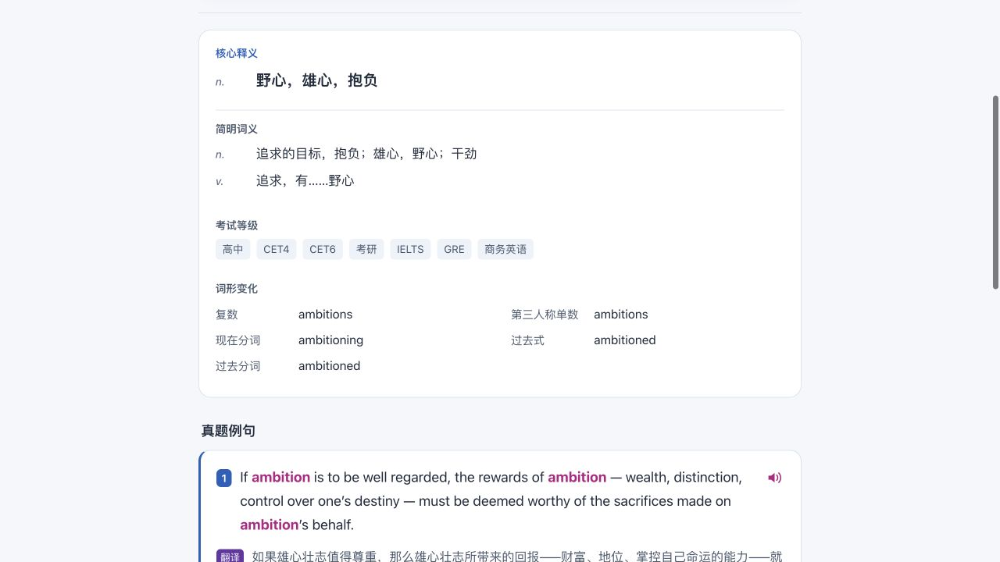
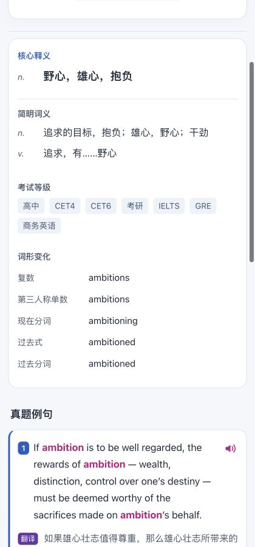

# 释义区阅读排版：调研与落地

## 后续：词形区域紧凑化

用户指出桌面词形单列过长、右侧留白过多。本轮仅修改 CSS：680px 及以上窗口改为两列，正常五项词形占三行；窄窗口自动单列；减小词形行间空隙，保持全部标签和单词。原文本、渲染器与交互不变。

浏览器验证：1280px 下两列各约 350px，词形列表高约 98px，五项均完整；420px 下自动单列，均无横向溢出。Anki 26.9.3 backend 隔离覆盖导入报告为 `output/compact-forms-verification.json`；不操作用户资料库。本次为局部低风险呈现修复，复用前轮未改内容与解析逻辑的验证，不重复新增 CSS 实现镜像测试。

最新交付：`output/Anki-词形紧凑版.apkg`。旧版文件保留。本地 `output/preview.html` 已同步更新。

日期：2026-09-26。模式：change；目标：local-trial；类型：bug；风险：R1（局部呈现调整，完整转义和内容保留验证，未改变数据库或卡片身份）。继续已有工作分支，不执行远端发布。

## 依据与取舍

没有一种字号或布局能证明对所有人都“最舒服”。本轮采用可追溯的可读性原则，并以用户提供的 Anki 窄窗口为验收场景。

1. [NN/g：How Chunking Helps Content Processing](https://www.nngroup.com/articles/chunking/) 说明，将相关信息组织成有意义的小块有助于扫读与理解。本项目据此将不同词性的释义分别成行，将等级与词形分为不同内容组；不把记忆表现提升作为已验证结果。
2. [GOV.UK：Summary list](https://design-system.service.gov.uk/components/summary-list/) 将描述列表用于键与值。本项目据此使用 `dt/dd` 表示词形名称及对应单词，避免依靠竖线寻找对应关系。
3. [W3C：Understanding SC 1.4.8 Visual Presentation](https://www.w3.org/WAI/WCAG21/Understanding/visual-presentation) 讨论左对齐、行距、行宽与缩放重排对阅读的影响。本项目保持左对齐及约 1.7 倍正文行高，并进行 320/420 CSS 像素窗口验证。该来源是 AAA 条款解释，不等于本项目已获 WCAG AAA 合规，也不能将某个数值当作所有人的唯一最优值。

曾检索 Cambridge ambition 词条，但全文获取失败，不以该页作为实际排版判断证据。检索原始输出保存在忽略目录 `output/reading-research/`。

## 具体变化

- 词性简写独立成列，释义保持原文字义；名词/动词分行。
- 核心释义使用适度加重，降低与正文之间的字号落差。
- 考试等级作为完整文字标签自然换行，常规标签不会拆散；异常超长自定义内容允许安全换行。
- 词形每项一行，名称及单词垂直对齐。未知或不完整格式仍原样可见，不吞掉内容。
- 减少横线，以留白区分相关信息；不折叠用户需要阅读的内容。
- 显式重置句子按钮的宿主默认最小宽度、阴影和内边距，避免 Anki 把图标撑成大按钮。音频逻辑未改。
- 所有 HTML 文本均先转义；10 个字段顺序和稳定 ID 未改变。

## 证据与范围

- 67 项 Python 测试通过，新增针对词性分组、等级完整性、多词词形、未知格式及 HTML 注入的验证。
- 1,960 张卡、7,840 个字段进行渲染前后正文核对：仅显示分隔符和空白变化，正文保留；源数据库哈希未变（`output/reading-content-check.json`）。
- 浏览器 420px 窄窗口截图与 320px DOM 检查：无横向溢出，7 个考试标签内容完整、词形一一对应。
- 独立审查未发现内容丢失或注入问题；提出的异常长标签换行问题已处理。
- 安装的 Anki 26.9.3 backend 隔离覆盖导入：1960 笔记、1960 卡片、1960 MP3，所有 ID 相同，样本复习进度保留。报告：`output/reading-verification.json`。未自动导入用户资料库，截图属于浏览器预览；不宣称已完成实际 Anki GUI/朗读验收。
- 本轮环境中 `uv run anki-pipeline` 入口出现包解析失败；通过当前工作区 `uv run python -c 'from anki_pipeline.cli import main; raise SystemExit(main())' build ...` 完成构建，未将入口问题冒充已修复。

交付：`output/Anki-舒适阅读版.apkg`。

SHA-256：`26ab55828177f21577edbe592a914c15734e4250bf2eb9b58862c4a379e2ae2f`。

上一版包和样式保留供对照；若需默认导入方式回退，应重新构建前版内容产生较新的更新时间。

## 窄窗口实际预览

发布准备补充（2026-09-26）：已定位上述入口问题为 macOS 将 editable `.pth` 标记为 hidden，Python 3.13 因此跳过该文件。重新安装当前版本并清除本机 `.pth` hidden 标记后入口恢复；独立 wheel 安装与仓库外命令检查纳入 rc.2 验收，结果见 RELEASE_RC2.md。

后续补充：hidden 标记复发，rc.2 本机最终采用非 editable 安装（`uv sync --frozen --extra dev --no-editable` / `uv run --no-editable`），见更新后的操作文档。
