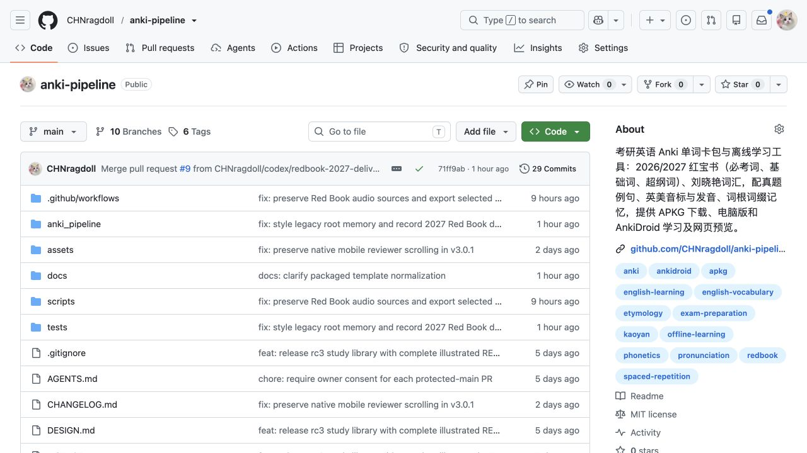

# README 与 About 更新证据 · 2026-10-06

本记录配合 [仓库首页](../README.md)，在保留原有完整文档与历史图片的基础上，补充三套发布包入口、来源规则、当前网页截图和华为实机截图。

## GitHub 简介与搜索相关信息

About 使用中文，直接包含“考研英语、Anki、2026/2027 红宝书、必考词、基础词、超纲词、刘晓艳、真题例句、英美音标与发音、词根词缀、APKG、AnkiDroid、离线学习、网页预览”等实际功能与资料名称。Homepage 指向本仓库 Releases。

Topics 为 `anki`、`ankidroid`、`apkg`、`kaoyan`、`english-vocabulary`、`english-learning`、`exam-preparation`、`spaced-repetition`、`pronunciation`、`phonetics`、`etymology`、`offline-learning`、`redbook`。这些词用于准确描述项目与提高检索匹配，不承诺搜索引擎排名。

已通过 GitHub API 读回 description/homepage/topics，并在实际仓库页面确认：

## 华为实机

设备为华为 OCE-AN10，Android 12 / API 31，AnkiDroid 2.20.1。通过连接的实际手机捕获原始屏幕，未用浏览器手机尺寸或模拟器替代。

本次读取现有刘晓艳牌组：在 Card Browser 预览 `action` 的正面，点击预览翻面按钮查看背面，再实际向下滑动查看词根与派生词。新图证明现有卡片可见、背面持续显示、内容能滚动；手机上该包的摘要与最新 Release 的对应关系未建立，故不把它作为 2026/2027 新包真机验收。未评分、导入、删除或手动同步。

| 界面 | 原始截图 |
|---|---|
| action 正面 | [截图](../assets/screenshots/readme-20261006/huawei-liu-existing-front.png) |
| action 背面 | [截图](../assets/screenshots/readme-20261006/huawei-liu-existing-answer.png) |
| 背面向下滚动后的词根内容 | [截图](../assets/screenshots/readme-20261006/huawei-liu-existing-roots.png) |

README 保留的 2026-10-04 ambition、embarrass、fare 图片是当时刘晓艳 v3.0.1 的实际复习证据，已有捕获清单；未将旧图改标为新拍摄。iPhone / AnkiMobile 没有本次直接实机截图。

## 电脑版

本次新图片来自实际桌面浏览器，覆盖：

- 本机 8771 书架的刘晓艳、2026、2027 三套入口；浏览、独立学习和卡包下载链接。
- 2026 搜索 `water`：结果仍为 `waterfall → waterproof → water → watershed`，选中并显示 `water`，不是把列表重新排序。
- 2027 `according`：英美选择器及蓝/红播放入口独立，首选词典缺音时持续显示牛津回退说明。
- 2027 `apple`：词根列表及 `applicable` 例句展开，保留灰底例句、蓝色目标词和折叠箭头。

网页资源版本目录以对应 APKG 的 SHA-256 命名。2027 为 `86843d8d71342ad6b5a80b8a3235e0164d7f1e549e41dbe1252d0c46077a9c40`；2026 为 `207a28718f27a3d38c09cac3afc3ec7ff2ba094615e259e72b38f76d9f6275c8`。

**原生 Anki 截图限制：**电脑版 Anki 26.9.3 在本次浏览器/无障碍界面操作中出现崩溃，并出现可能与插件有关的错误提示，未取得可靠的原生卡片截图。没有为截图修复个人集合、禁用插件或改动学习状态。上述电脑版新图明确标为网页，隔离 Anki 后端导入核验也不代替原生 GUI 截图。

## 发布附件对应关系

2027 正式版为非草稿、非预发布，标签 `redbook-2027.10.06` 对应合并提交 `71ff9ab68b10974270e5bf769a156da94c661780`。完整回下载 APKG 摘要与本地上传输入一致；四个附件的远端摘要均匹配；ZIP 与引用媒体核验通过。详见 [交付记录](REDBOOK_2027.md) 和该 Release 的核验附件。

2026 与刘晓艳保留各自标签及附件。本次文档调整不重新打包、不移动标签、不覆盖或删除历史附件，不改变 Python 包版本。

## 捕获与可复核范围

[捕获清单](../assets/screenshots/readme-20261006/capture-manifest.json) 逐图记录时间、尺寸、SHA-256、入口、方式和限制。照片未经内容改写；图片中未包含设备序列号、凭据、私人通知正文、私人路径或其他个人牌组。网页与手机屏幕只证明当时可见内容，不能单凭图片证明声音正确、外部协议跳转、全文语义无误或整个账户同步成功。
