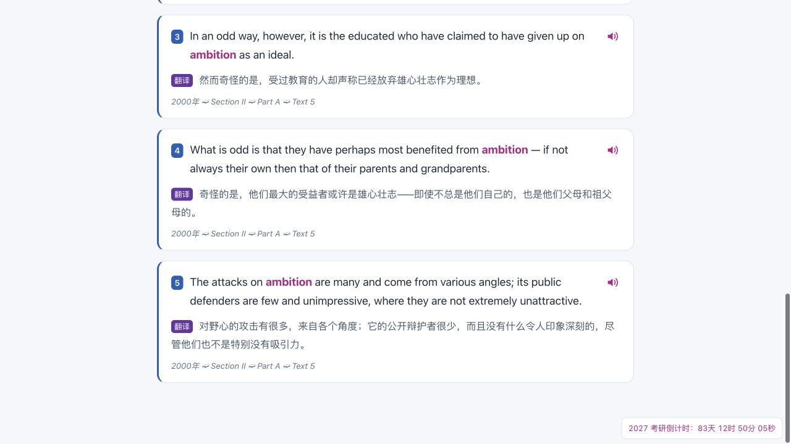

# v3.0.0-rc.2 发布记录

2026-09-26，用户明确要求“发布这个版本吧”。模式 release；目标 formal-version-delivery；仓库 CHNragdoll/anki-pipeline 保持私人。主要变更类型 bug，风险 R2：模板、序列化字段和外部朗读影响已有笔记显示及学习内容，需要稳定身份、转义、网络和覆盖导入检查。

## 本次范围

发布累计确认的原版交互恢复、阅读排版、紧凑词形和 2027 考研倒计时。发布资产计划包括源码归档、可导入 APKG、构建/验证报告和 SHA-256 清单。APKG 含 owner 学习文本与音频，仅在既有私人 owner-only 仓库分发；原始 SQLite、CSV、音频目录和备份不进入 Git。依赖版本、数据库 schema 和原始资料不变，不操作用户正在使用的 Anki 集合。

原版本发布记录 [RELEASE.md](RELEASE.md)、conformance.json 及旧测试结果均为历史基线。本次采用基线加变更验证，不声称重新审核全部 92 项控制或生产可用。

## 本次获批的等效控制

GitHub 私人仓库分支保护 API 本次仍返回 403（套餐限制）。rc.1 的批准明确“不适用于后续版本”，已随 rc.1 发布用尽。在 PR #2、本地检查、独立审查和最新双版本 CI 均准备完成后，用户于 2026-09-26 对具体控制回复“ok”，明确批准仅本次 rc.2 采用下述等效控制并继续合并和发布。

本次批准的具体控制：保持私人且仅 owner 访问；使用真实 PR；核对最新 PR head 的 Python 3.11/3.13 CI 全部通过；独立审查无未处置阻塞；通过 PR 显式 merge commit 到 main；再创建 annotated tag 和私人 prerelease。仅本版本有效，最迟 2026-10-03 失效。GitHub 不能强制阻止 owner 绕流程推送，因此执行者逐项核对且保留记录。后续版本重新检查服务端保护或获得新的决定。

这是本次新批准，不复用 rc.1 的已耗尽批准。仅此发布有效，完成发布即用尽，最迟 2026-10-03 失效。自动分支保护仍未开启，不把人工核对声明为 GitHub 强制保护。此批准记录提交后，必须再次核对最新 PR head 的 CI，再通过 PR 合并。

## 验收与证据

| 要求 | 方法与证据 | 边界 |
| --- | --- | --- |
| 原版交互、转义、字段身份 | tests/test_packaging.py、test_presentation.py；隔离 Anki 覆盖导入 | 保持重建版模型/字段/GUID，不迁移 V2.0 进度 |
| 倒计时准确、不为负、计时器清理 | tests/test_countdown.cjs；COUNTDOWN_2027.md 截图 | 2026-12-19 08:30 +08:00，2027 招生年度 |
| 例句朗读编码、切换、超时和取消 | tests/test_sentence_playback.cjs | 模拟测试不能证明设备实际出声 |
| 阅读排版、窄屏/夜间 | UI_POLISH.md、READING_LAYOUT_RESEARCH.md 对应截图 | 来自先前同一模板内容的浏览器实测，非 Anki GUI 截图 |
| 安装与模板资源 | clean wheel 安装，仓库外 CLI 与 importlib.resources 检查 | CI 双 Python 版本重复验证 |
| 数据、媒体与恢复 | scripts/verify_local_trial.py | 核验 12 个原资料摘要、重复迁移幂等、备份恢复对账、1,960 媒体摘要 |
| 覆盖导入不增加卡片 | scripts/verify_anki_import.py | 安装的 Anki backend 临时集合，全部 ID 与一个复习进度样本；不操作用户集合 |
| 版本/源码/产物对应 | scripts/verify_project.py；最终 release-manifest.json、SHA256SUMS.txt | 最终清单须绑定真实 merge SHA/tag，不能预填未来值 |

本地结果见 [rc2-verification.json](rc2-verification.json)：67 项 Python 测试、两组 Node 行为测试、JS 语法、版本/记录校验、独立 wheel 安装与仓库外 CLI 均通过。12 个原始文件摘要未变，重复迁移幂等，备份恢复摘要相同，卡包内 1,960 个媒体与本地逐一一致。20 个第三方锁定条目与 rc.1 完全相同；同日依赖审计作为历史基线复用，没有伪称重新联网审计。源码常见凭据模式扫描未发现命中。

Anki 26.9.3 backend 的 rc.1 → rc.2 临时集合覆盖导入通过：1,960 个 note/card ID 与 GUID 不变，样本复习间隔/到期日/次数保持，1,960 MP3 保留，实际正反面 HTML 元素分离。EuDic 此处只检查模板链接脚本存在，浏览器 JS 行为另见历史同内容截图/记录。首次验证失败由共享 CSS 类名误判造成，验证器已改为解析真实元素；没有为此修改产品模板。独立审查已完成（`/root/text_pipeline`，2026-09-26，审查提交 `d81e3d3` 的累计代码与新增文件）：未发现阻塞实现缺陷；HTML 转义、稳定身份、计时器/朗读生命周期、wheel 资源、backend 证据边界均核对。审查指出的历史文档标识和 EuDic 脚本证据措辞已处理；后续仅更新本记录。PR #2：https://github.com/CHNragdoll/anki-pipeline/pull/2。最终 Release 资产记录 PR、CI、merge、tag 与文件摘要，发布前门禁状态不冒充最终结果。

## 兼容性与已知限制

- 共 1,960 张卡片、1,960 个音频、41 个课程子牌组；每卡最多 5 条可用例句。
- 7,660 条旧匹配隔离保留；36 条通过匹配的译文待核验，304 个单词无可用例句。
- 例句扬声器仅在点击时向有道 HTTPS 发送英文句子，失败后尝试系统语音。当前不保证特定设备/服务能够发声；卡片显示不会自动发送句子。
- EuDic 链接、视觉截图及 backend 导入有针对性验证；本候选版不声称 Anki 桌面 GUI、AnkiMobile、AnkiDroid 全流程已验收。
- 覆盖先前重建版使用稳定身份；原 V2.0 仍形成独立笔记。Anki 导入选项可能覆盖 Note 字段，个人备注应先备份。
- 本机 editable `.pth` 的 macOS hidden 标记曾导致 Python 跳过安装路径。干净 wheel 安装正常；hidden 标记在本机再次出现，因此本机已改用 `uv sync --frozen --extra dev --no-editable`，操作文档使用 `uv run --no-editable`，通过普通安装避免依赖 editable `.pth`。不以项目目录导入成功代替安装证据。

## 回滚

保留旧 APKG、V2.0 原资料及当前库备份。用户导入前应使用 Anki 自身备份；若导入后要恢复个人笔记/进度，恢复导入前 Anki 备份。直接重新导入旧包不保证回退模板与字段。流水线数据库恢复到新路径并对账，不覆盖原文件。发布 tag/资产不移动或覆盖，后续修正发布新版本。

