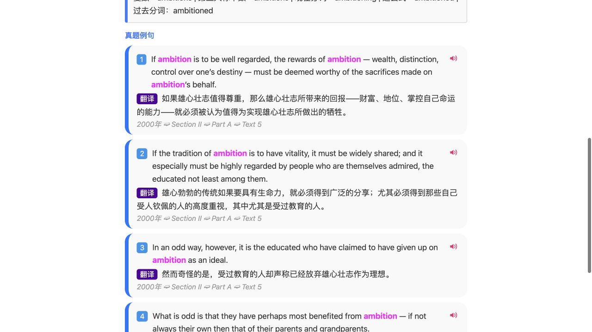
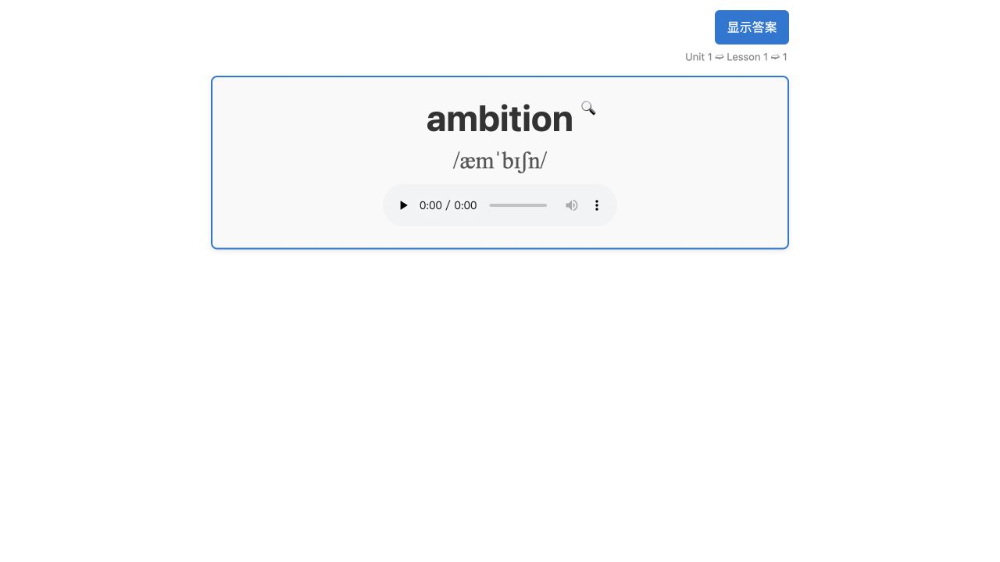
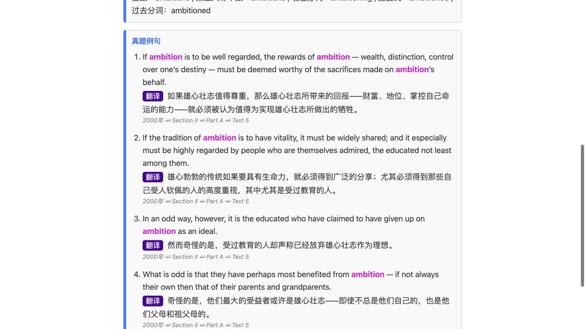
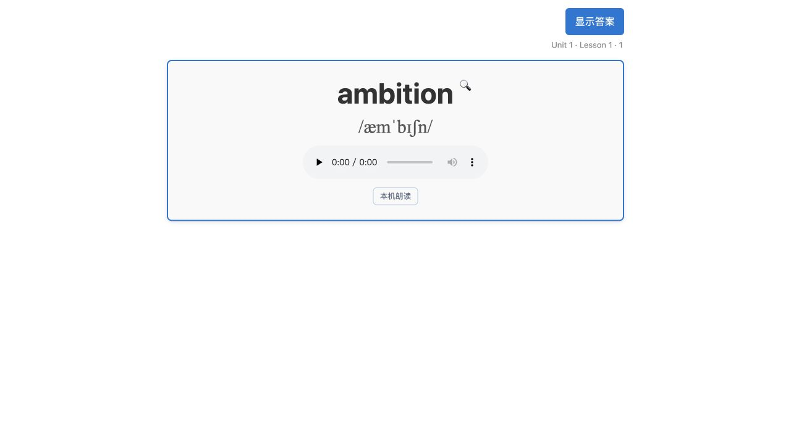
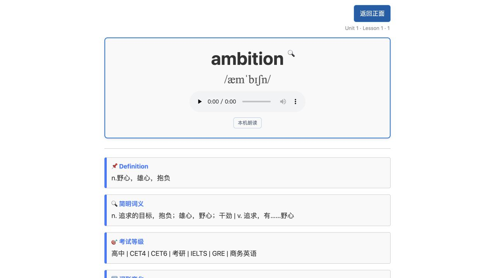
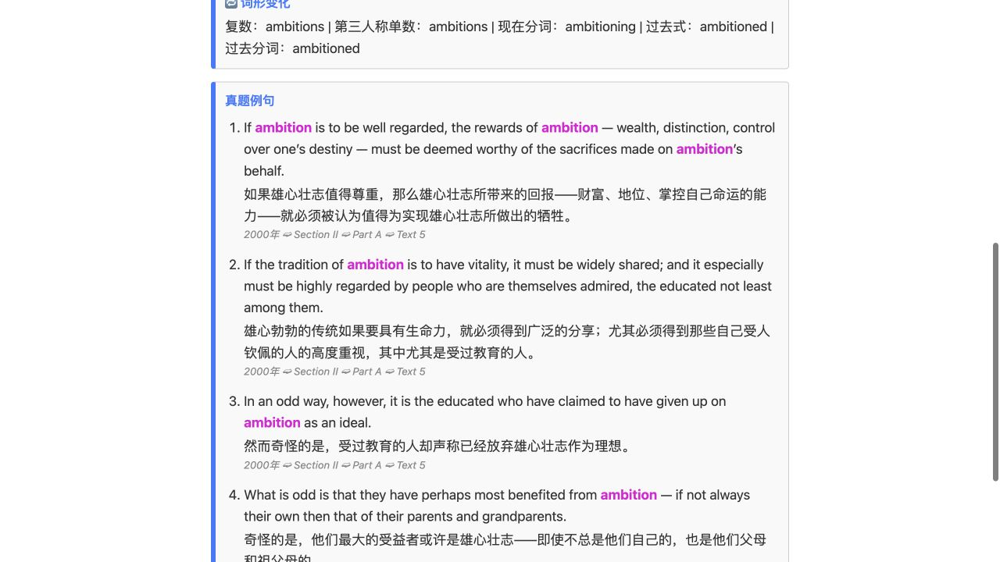

# 原模板交互恢复验证

## 最新：原版例句卡片样式

按用户原版截图，恢复独立浅灰圆角例句卡、左侧蓝线、蓝底白字编号、粉色英文朗读喇叭、紫色翻译标签、底部灰色斜体出处。保留目标词粉色加粗与顶部 ➫ 分隔，不恢复已删除的单词本机朗读按钮。

交付：`output/Anki-原版例句样式.apkg`。SHA-256：`a7f5df02063dca53f4401665c91b3f4477c87053dda4e8e3a41a0a6debacd845`。

验证：63 项 Python 测试通过；`node tests/test_sentence_playback.cjs` 验证编码、多行、切换、旧回调、停止及失败超时；Anki 26.9.3 backend 覆盖导入仍为 1960 卡片，ID 与样本进度保留（`output/example-style-verification.json`）。浏览器已验证 5 条预览例句的编号、标签、图标和无横向溢出。浏览器点击朗读没有获得可确认的音频播放状态，不能据此宣称实际发声成功；Anki 内发声仍待实际试听。

原喇叭使用有道在线朗读，点击才将该条英文发送到有道；失败回退系统语音。已同步网络边界说明，审查发现的多行与超时问题已修复。此次仅本地试用。

## 最新细节修正版

按用户截图去掉“本机朗读”入口及相关脚本，保留录音播放；译文前恢复原来的紫底白字“翻译”标签；顶部路径改为 `Unit 1 ➫ Lesson 1 ➫ 1`。

最新交付：`output/Anki-原模板恢复版-细节修正版.apkg`，SHA-256：`a89002237c0d50d7ee3c6ef12ec371eefdfc59d6386c6095db646af82f2778ce`。63 项测试通过；Anki 26.9.3 backend 在隔离资料库中从上一恢复版覆盖导入本包，1960 卡片及笔记 ID 不变、样本复习进度保留，并验证三处修改实际进入导入结果。报告为 `output/template-details-verification.json`。本次仍为本地试用，无远端发布或用户资料库写入。

以下为前一版的修复记录与截图。

2026-09-26。本次为本地试用修复（change / local-trial），不构成新版本发布。范围为恢复原卡片正反面、欧路查词入口和真题目标词高亮。保留模型、字段顺序、笔记 GUID 与卡片 ID；未操作用户 Anki 资料库。

## 正面与翻面

正面显示单词、音标、录音和右上角查词入口；Anki 显示答案后出现释义与例句。浏览器预览增加显示答案/返回正面按钮，避免预览同时展示两面。

## 欧路与例句

恢复原协议 `eudic://x-callback-url/searchword`，传入当前词，并携带返回 Anki 的 `x-success`。浏览器 DOM 已验证生成地址正确；本次未实际验证操作系统唤起欧路及回跳。

真题中的目标词和显式词形使用粉色加粗标记，保留单词边界并转义文本。浏览器验证 ambition 的 7 处匹配均有高亮，页面没有横向溢出。

## 导入证据与边界

使用已安装的 Anki 26.9.3 backend，在临时资料库先导入上一试用包、设置一个样本的复习状态，再导入本包。仍为 1960 笔记、1960 卡片、1960 MP3；所有笔记与卡片 ID 不变，样本复习进度保留。实际用户资料库未触碰。截图来自浏览器预览，不代表 Anki GUI 验收。

交付文件：`output/Anki-原模板恢复版.apkg`。

SHA-256：`168d9c9a13c565e2956f657c6da961834d008cddac08ae8e853aefd00abc78ec`。

详细本地导入证据：`output/template-update-verification.json`；独立 diff 审查未发现阻塞问题。若用户自行修改过字段，导入前保留自己的备份，并核对 Anki 的更新选项。
