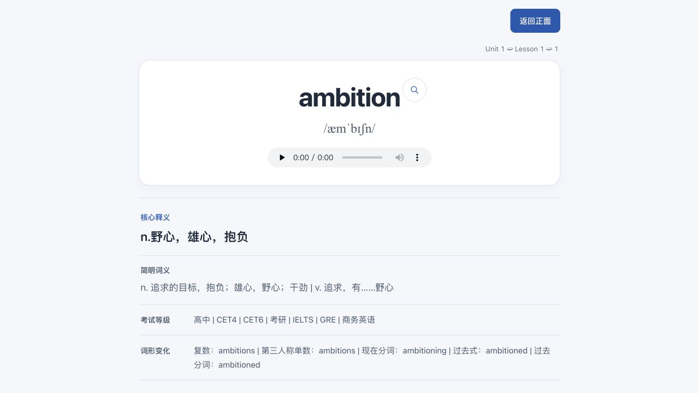
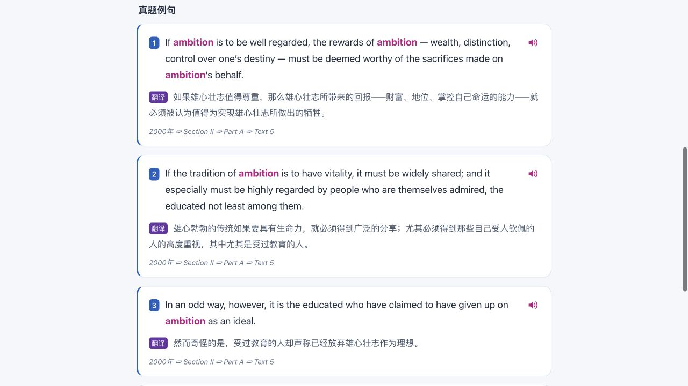
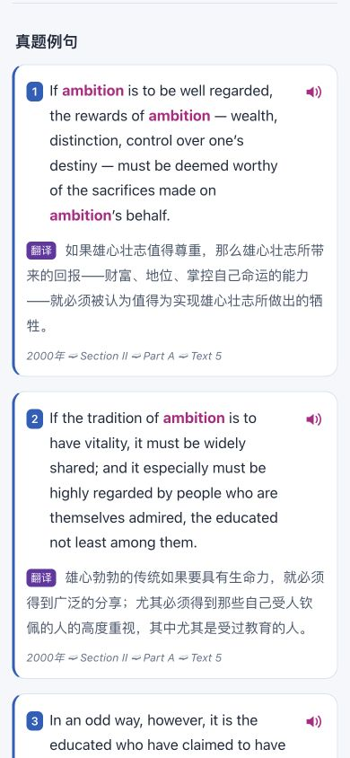
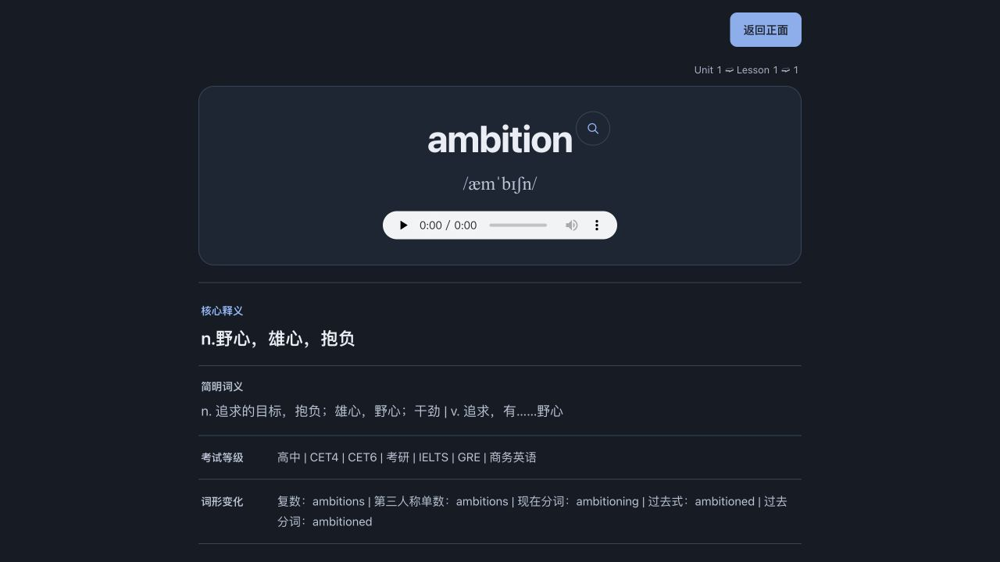

# 卡片 UI 优化（本地试用）

任务模式：change；交付目标：local-trial；类型：feature；风险：R1。在已有 `fix/template-parity` 工作分支继续，保留此前修复。本批仅改变 HTML 呈现与 CSS，不修改数据、卡片 ID、查词或朗读逻辑，不发布远端版本。

计划：统一颜色/字体/间距；突出词头与核心释义；把辅助释义区域改为轻量排版；保留原版例句编号、翻译标签、朗读入口及高亮；检查桌面、窄屏和夜间显示；验证新包覆盖导入。

场景：用户坐在电脑前连续复习并阅读长篇真题句子。默认使用低干扰浅色背景，同时适配 Anki 夜间模式。原版例句左侧蓝线属于用户明确给出的参考，保留为细线，不扩展到其他信息区。

验收：正面不泄露释义；翻面、欧路和音频按钮仍存在；窄屏不横向溢出；各辅助区不抢占目标词视觉焦点；导入后 1960 卡片且已有 ID、样本进度保留。

## 结果

- 词头区采用白色背景和细边框；查词使用统一线性图标，保持右上角入口。
- 核心释义突出显示；简明释义、考试等级、词形按阅读优先级排版，减少重复框线。
- 例句保留蓝色编号/细蓝线、紫色翻译标签和粉色目标词；正文、译文、出处使用不同字阶与间距。
- 桌面预览、390px 实际例句、320px 超长词正反面均无横向溢出。已检查 `.nightMode` 配色和减少动态效果规则。
- 12 组主要文字颜色对比度为 4.60–14.73；原生音频控件由宿主绘制，不在此检查内。
- 63 项 Python 测试通过；独立审查未发现阻塞 UI 回归。之前的朗读功能测试作为未改逻辑的历史证据，不重新宣称声音验收。
- 安装的 Anki 26.9.3 backend 从上一包覆盖导入本包：1960 笔记、1960 卡片、1960 MP3；ID 与样本复习进度保留。用户资料库未修改，实际 Anki GUI 仍由用户导入查看。

交付：`output/Anki-UI优化版.apkg`。

SHA-256：`bfe9ab5cc974d29981e93eb93e3ee49b46908fa98501776319df26dcee6469e2`。

证据：`output/ui-build.json`、`output/ui-verification.json`、`output/ui-contrast.json`。上一可用包 `output/Anki-原版例句样式.apkg` 仍保留；样式前版保存在 `output/template-before-ui.css` 和 `output/template-before-ui-back.html`。需要回退时应从前版源码重新构建较新的更新包，而非假定 Anki 默认会接受时间较旧的模板。

## 浏览器截图

