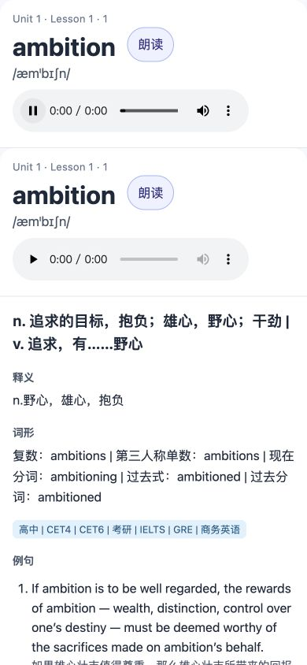

# 验证记录

范围：重建候选版 `3.0.0-rc.1`，macOS arm64，CPython 3.13.14，锁定依赖。代码、数据与浏览器验证分别记录，不把结构检查等同于 Anki 客户端验收。

## 自动化与真实数据

`uv run python -m unittest discover -s tests -v`：61 项通过。覆盖精确词形、编号解析、幂等迁移、异常回滚、备份恢复、CSV 内容/版本对齐、稳定牌组/笔记 ID、媒体安全、原子输出及关键 CLI 路径。

`scripts/verify_local_trial.py` 复核原始输入哈希、数据库完整性、重复迁移、备份恢复摘要及成品卡包；机器记录在 `docs/local-trial-verification.json`。原始脚本、数据库和词表均保持原样；原始媒体未写入。部分新音频由已存在旧卡包恢复，校验媒体索引、CRC、MP3 类型及大小，未解压任意归档路径。

| 观察值 | 数量 |
| --- | ---: |
| 单词/新卡片/MP3 | 1,960 / 1,960 / 1,960 |
| 保留句子 | 23,508 |
| 通过词形匹配 | 15,848 |
| 隔离并保留 | 7,660 |
| 通过匹配但译文待处理 | 36 |
| 有至少一条完整例句的词 | 1,656 |
| 基础数据错误 | 0 |

“通过匹配”仅指明确词形命中，不等于人工确认每句语境、出处和译文均正确。未通过的派生形式或误命中均保留，便于人工复核；没有删除学习原始资料。

## 真实 PDF 与远端 CI

实际读取本机真题 PDF，对 `rate`、`theme`、`fee` 分别提取 67、4、14 条候选例句，来源字段均非空，耗时 9.5 秒。本次只读抽取，未写数据库；记录见 [PDF 验证摘要](pdf-smoke-verification.json)。这不是全量语义/版面准确性验收。

[PR #1](https://github.com/CHNragdoll/anki-pipeline/pull/1) 的 [GitHub Actions](https://github.com/CHNragdoll/anki-pipeline/actions/runs/36234389371) 在提交 `3d785267` 上通过 Python 3.11、3.13 两组检查；每组执行锁定安装、61 项测试、标准记录与语法检查。后续文档提交的状态以 PR 当前检查为准。

## 桌面宽度与录音

在 Codex 内置浏览器以 1280×900 视口检查实际 `output/preview.html`，无横向溢出。录音改为预览内嵌媒体，避免 HTTP 页面加载 `file://` 的限制。点击实际播放控件后观察：`paused=false`、`currentTime>0`、`duration=0.869478` 秒、`error=null`。这证明该样本在浏览器中开始播放，不代表所有音频和所有 Anki 客户端均已试听。

## 手机宽度

同一实际页面以 390×844 检查，无横向溢出，释义、词形和例句正常换行。截图为浏览器响应式测试，并非 AnkiDroid/AnkiMobile。

## 已知边界

- Anki 桌面/Android/iOS 实际导入、复习进度迁移：**NOT_RUN**。
- 全量语义及翻译质量人工校对：**NOT_RUN**；36 条待处理 CSV 已导出。
- 词典实时抓取可用性：采用固定页面与异常模拟验证；没有把旧抓取结果当成今日在线可用证据。
- 远端分支保护：**BLOCKED**，GitHub 当前私人仓库 API 返回 403；不是已批准例外。
- 标准的全部 92 控制已有适用性记录，完整生产/发布合规状态见 `CONFORMANCE.md`，不从测试数推导通过。

## 当前权限与源码边界

2026-09-26 只读检查：私人仓库协作者仅有 `CHNragdoll`（admin），CI 权限为 `contents: read`。本机 `Documents` 和 `PyCharm` 上级目录为 apple 所有、0700；数据文件虽为 0644，其他普通本机用户仍不能经这些目录访问。没有改变本机权限。源码清单不含 data/output/backups/.venv、数据库、词表、MP3 或卡包；凭据格式扫描未发现命中，仅代表所检模式，不是通用安全保证。
