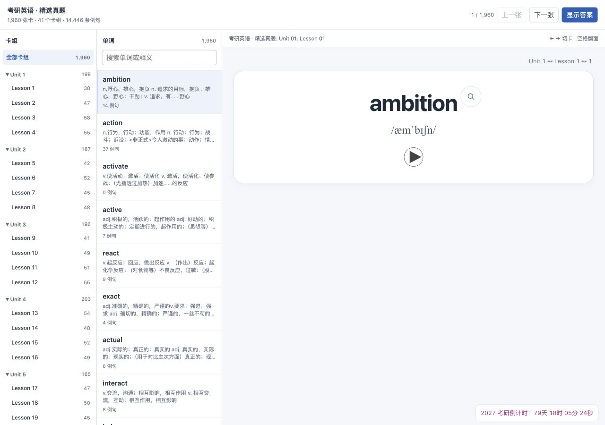
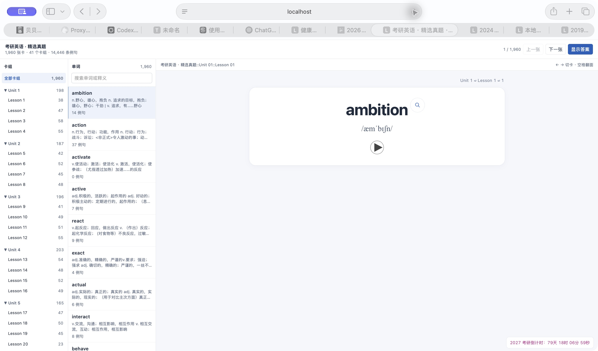

# 全卡组网页预览

> 下方 rc.3 和单录音版本图片为历史证据；2026-10-06 当前入口与截图见 [仓库首页](../README.md) 和 [证据记录](README_EVIDENCE_20261006.md)。

## 2026-10-06 本机书架与独立复习

打开 [http://localhost:8771/](http://localhost:8771/)：书架已加入刘晓艳、2026 红宝书、2027 红宝书，各自提供浏览、独立复习和卡包入口。红宝书的卡片、目录和本地媒体来自各自完整包；网页保留原顺序，精确词搜索优先定位完整词条。2027 基础词 Unit 31 已在 `a/an` 处拆分为两组。

本机独立复习服务使用已有 FSRS 库，学习进度独立保存；不读写用户 Anki 集合，也不连接 AnkiWeb。这是维护者本机的部署状态，服务与资源位于本地生成目录；以下 `web-preview` 命令导出的仍是静态浏览页，不包含这个服务。APKG 正式下载入口见 [首页](../README.md#下载-anki-卡包)。真题原卷跳转另需配套题库服务。

## 静态预览与历史实现记录

最新的双词典离线包、左上发音选择器、词形与派生词分区、完整媒体覆盖及当前验收见 [本地双词典交付记录](LOCAL_DICTIONARY_BUNDLE.md)。下文保留此前单录音网页版本的历史证据，数量与测试结果不代表最新词典包。

本次为 feature / R2 本地试用。将单个词条的预览扩展成整个词库的浏览入口，沿用现有 Anki 正反面模板与颜色。目录按实际 Unit / Lesson 分组，包含没有真题例句的词卡；不创造源词库没有的卡组。

## 使用与生成

打开 <http://localhost:8771/preview-library.html>。通过目录切换卡组，搜索单词或释义，选择词卡，使用“显示答案”和前后张按钮浏览。窄窗口以目录抽屉代替挤在一起的多栏。空格翻面，左右箭头切卡，输入文字时不拦截这些按键。地址保存当前卡片及卡组，刷新后恢复位置。

单词音频、欧路查词、全部真题例句及逐句译文、详细出处和 LaTeX / 整卷原句跳转继续使用原模板。完形只给真实回填答案加下划线。网页用于可视化预览；不进行评分、复习排程、真实 Anki 导入或同步。

```sh
.venv/bin/python -m anki_pipeline web-preview
.venv/bin/python -m http.server 8771 --bind 127.0.0.1 --directory output
```

命令只读取 SQLite，并在内存中调用题库句子索引。生成所有卡片 HTML、目录 JSON、页面资源及共享 MP3，不内联重复音频。题库配置 `max_examples=0` 继续表示导出所有匹配例句。它不会重新生成 APKG，不覆盖现有构建报告或原资料。

## 恢复与验收

资产保存在 `output/web-preview/<内容摘要>/`。完整版本构建、校验成功后才原子替换入口；旧版本留存。失败不会把可用入口换成半成品。`output/web-preview-report.json` 记录数量、目录位置和源库内容摘要。输出路径不能覆盖源数据库、配置、音频或备份目录。

验收顺序：生成器校验完整卡组与媒体、失败恢复；CLI 校验源库和 APKG 不改写；交互检查切组、搜索、翻面、键盘及错误状态；真浏览器分别查看桌面和窄窗口，试播音频、检查原句跳转与刷新恢复。最后围绕本次新增代码、数据完整性和实际截图做一次独立审查。

## 历史网页版本运行证据

实际目录包含 1,960 张卡、41 个课卡组、14,446 条真题例句，1,960 份单词音频。包含无例句词卡，以及源数据中的 Unit 999 / Lesson 999；不根据是否有例句删词或改组。

Python 121 项测试通过；网页交互、原卡片脚本及倒计时共 26 项 Node 测试通过。实际浏览器已验证切换 Lesson 5（42 张）、搜索空结果、清空搜索、前后张、显示答案、刷新恢复、窄窗口目录、音频播放，以及真题原句高亮。`dominate` 9 条例句的页面保留完形回填的下划线；`present` 背面呈现全部 29 条例句。

本次只生成网页目录与卡片文件，源 SQLite 内容摘要为 `0fd7f815e89eacfe9d6293d1070bb9d085864c0055d0d530f1c5d9a866db8ffe`。现有 `Anki-题库例句跳转版.apkg` 的 SHA-256 仍为 `e6b31d39e1fc46f68fc0661d7b71a75fed6b3df9680fdfe879e4da9ce2fda2e4`。




实际截图覆盖桌面和窄窗口，并按用户反馈额外检查卡片内层宽度。右侧区域固定在可用视口中，卡片按区域宽度换行。单词文字独立居中，右上角查词按钮不参与文字中心计算。窄窗口中只对含 12 个及以上拉丁字母词段的长标题缩小字号，保留明示拼写与原换行；普通短词字号保持原样。

Safari 原问题可在页面缩放 75% 时复现：iframe 在 `display:none` 状态下首次导航，显示后子页面比例不正确，改变窗口尺寸才恢复。只改宽度约束未解决首次加载。最终改为先将 iframe 连接到确定尺寸的区域，用 `visibility:hidden` 保留布局盒，读取实际边界后再设置导航地址；加载成功后恢复可见性和 ARIA。连续正常刷新已验证，不依赖改变窗口尺寸或浏览器缩放。加载顺序回归覆盖首次加载及切换卡片。



全部正文和例句保留，通过统一盒模型、零最小宽度、长文字换行和框内查词按钮防止横向溢出，不剪裁正文来掩盖溢出。长背面内容仍在固定的右侧区域内纵向阅读。本次为本地预览验收，未操作真实 Anki 用户档案或发布版本。
